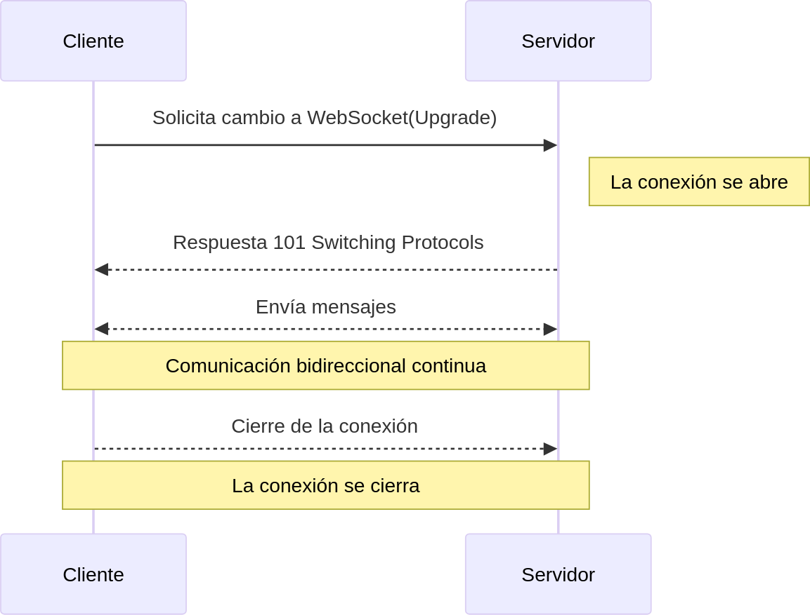

:toc: macro
:toc-title: Índice
:toclevels: 3
:sectnums: 3
:chapter-signifier!:

[[toc]]
toc::[]

<<<

== Introducción

WebSocket es un protocolo de red que permite mantener una conexión persistente y bidireccional entre cliente y servidor. Fue estandarizado en 2011 (link:https://www.rfc-editor.org/rfc/rfc6455[RFC 6455]) y está soportado por todos los navegadores modernos.

La comunicación comienza con una petición HTTP que incluye cabeceras especiales (`Upgrade: websocket`, `Connection: Upgrade`). Si el servidor lo acepta, responde con `101 Switching Protocols` y ambos extremos comienzan a intercambiar datos directamente. A diferencia de HTTP, la conexión no se cierra tras cada mensaje, sino que se mantiene abierta.

Este modelo permite eliminar la latencia asociada a nuevas conexiones y habilita una interacción continua en tiempo real.

== Ventajas

- **Full-duplex**: cliente y servidor pueden enviarse datos en cualquier momento, sin esperas.
- **Conexión persistente**: se abre una vez y permanece activa hasta que se cierre explícitamente.
- **Baja latencia y poco overhead**: los mensajes viajan en tramas ligeras, sin cabeceras HTTP repetidas.
- **Capacidad de push del servidor**: el servidor puede enviar datos sin necesidad de que el cliente lo solicite.
- **Seguridad opcional**: permite conexión cifrada con `wss://`, similar a HTTPS.
- **Soporte de mensajes binarios y de texto**: útil tanto para datos simples como para multimedia o protocolos propios.

== Comparativa con HTTP

[cols="1,1"]
|===
| HTTP/HTTPS
| WebSocket

| Comunicación *half-duplex*, basada en petición-respuesta
| Comunicación *full-duplex*, en ambos sentidos

| Cada mensaje abre y cierra una conexión TCP nueva
| Una única conexión TCP que se mantiene activa

| Alto overhead por cabeceras en cada petición
| Tramas ligeras con pocos bytes de control

| El servidor solo responde a peticiones
| El servidor puede enviar mensajes espontáneamente

| Protocolo usado principalmente para contenido estático
| Usado para comunicación dinámica y en tiempo real
|===

== Ejemplo de flujo

Este esquema representa el flujo básico de una conexión WebSocket:

1. El cliente solicita el cambio de protocolo a WebSocket usando HTTP.
2. El servidor responde con `101 Switching Protocols`.
3. A partir de ese momento, se establece un canal bidireccional persistente.
4. Ambas partes pueden intercambiar mensajes sin necesidad de nuevas solicitudes.
5. La conexión se mantiene abierta hasta que una de las partes la cierra explícitamente.

== Casos de uso

WebSocket se usa en aplicaciones donde es necesaria la inmediatez y la continuidad en la comunicación:

- **Aplicaciones de chat o mensajería**: intercambio rápido de mensajes sin recargar la interfaz.
- **Juegos multijugador en red**: sincronización constante entre jugadores.
- **Edición colaborativa**: documentos compartidas en tiempo real.
- **Streaming de datos**: gráficos financieros, sensores IoT, métricas de red o servidores.
- **Sistemas de notificación en vivo**: eventos push, alarmas o avisos automáticos.