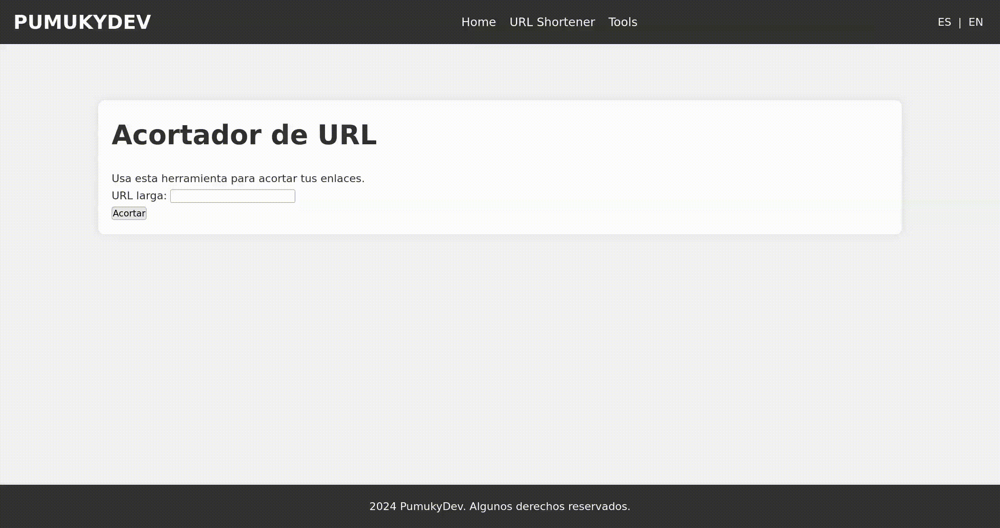

> [!CAUTION]
> The repository is in progress, please wait until the creator finish it.

# PumukyDev Web Server

This is my **self hosted web server**. At the moment it is hosted in my desktop computer with debian so **do not expect great availability** (In a few months it will be running 24/7 in a Raspberry Pi)

## Download

## Configuration

## Features
* Has a simple, but intuitive and usable User Interface.
* URL shortener tool.
* Status page.
* logo.png for some tests.
* Automatic provisioning made with Vagrant.
* /admin and /status password protection.
* Dynamic DNS configuration to autoconfigure my new home ip if it changes.

## URL Shortener in action...



## Other

<details>
    <summary><b>Performance tests</b></summary><br/>
Comandos para ejecutar las pruebas en https://pumukydev.com/
Pruebas iniciales

    Página principal con 100 usuarios y 1000 peticiones:

ab -k -n 1000 -c 100 https://pumukydev.com/

Página principal con 1000 usuarios y 1000 peticiones:

    ab -k -n 1000 -c 1000 https://pumukydev.com/

Prueba de recurso estático

    Logo o recurso estático (/logo.png):
        Con 100 usuarios:

ab -k -n 1000 -c 100 https://pumukydev.com/logo.png

Con 1000 usuarios:

        ab -k -n 1000 -c 1000 https://pumukydev.com/logo.png

Prueba de autenticación básica

    Página protegida (/admin):
        Si /admin está protegida con autenticación básica, usa el parámetro -A para enviar las credenciales. Sustituye username y password con las credenciales correctas:

ab -k -n 1000 -c 100 -A "username:password" https://pumukydev.com/admin/

        ab -k -n 1000 -c 1000 -A "username:password" https://pumukydev.com/admin/

Pruebas con compresión

    Enviar cabecera para solicitar compresión:

        Página principal:

ab -k -n 1000 -c 100 -H "Accept-Encoding: gzip, deflate" https://pumukydev.com/

ab -k -n 1000 -c 1000 -H "Accept-Encoding: gzip, deflate" https://pumukydev.com/

Recurso estático:

ab -k -n 1000 -c 100 -H "Accept-Encoding: gzip, deflate" https://pumukydev.com/logo.png

ab -k -n 1000 -c 1000 -H "Accept-Encoding: gzip, deflate" https://pumukydev.com/logo.png

Página protegida:

ab -k -n 1000 -c 100 -H "Accept-Encoding: gzip, deflate" -A "username:password" https://pumukydev.com/admin/

ab -k -n 1000 -c 1000 -H "Accept-Encoding: gzip, deflate" -A "username:password" https://pumukydev.com/admin/
</details>

<details>
    <summary>
        <b>Files structure</b></summary><br/>

This is the my proyect files structure:

```
.
├── apache_exporter.service
├── compose.yml
├── config
│   ├── apache2
│   │   ├── apache2.conf
│   │   ├── certs
│   │   │   ├── intermediate
│   │   │   │   ├── intermediate1.cer
│   │   │   │   └── intermediate2.cer
│   │   │   ├── _.pumukydev.com_private_key.key
│   │   │   └── pumukydev.com_ssl_certificate.cer
│   │   └── sites-available
│   │       └── pumukydev.conf
│   ├── dynamic-dns
│   │   ├── dyndns-cronjob
│   │   ├── get_url
│   │   │   └── dyndns.sh
│   │   └── README.md
│   └── monitoring
│       ├── grafana
│       │   ├── dashboard.json
│       │   ├── dashboard.yml
│       │   ├── datasources.yml
│       │   └── grafana.ini
│       ├── images
│       │   ├── grafana_change_passwd.jpg
│       │   ├── grafana_connections.jpg
│       │   ├── grafana_graph.jpg
│       │   ├── grafana_login.jpg
│       │   ├── grafana_prometheus.jpg
│       │   ├── prometheus_add_source.jpg
│       │   ├── prometheus_settings.jpg
│       │   └── prometheus_succed.jpg
│       ├── prometheus
│       │   └── prometheus.yml
│       └── README.md
├── htdocs
│   ├── admin
│   │   └── index.phpweb-server
│   │   ├── footer.php
│   │   └── header.php
│   ├── index.php
│   ├── logo.png
│   ├── shortener
│   │   ├── get_long_url.sh
│   │   ├── get_txt.sh
│   │   ├── get_zoneId.sh
│   │   ├── index.php
│   │   ├── post_txt.sh
│   │   ├── redirect.php
│   │   └── urlshortener.php
│   ├── status
│   │   └── index.php
│   ├── style
│   │   └── style.css
│   └── tools
│       └── index.php
├── playbooks
│   ├── main.yml
│   ├── tasks
│   │   ├── apache.yml
│   │   ├── dyndns.yml
│   │   └── monitoring.yml
│   └── vars
├── README.md
└── Vagrantfile
```
</details>

## License

This project is licensed under the **Apache License 2.0**. See the [LICENSE](LICENSE) file for details.

## Contribute

Want to contribute? There are multiple ways you can contribute to this project. Here are some ideas:

* 📃 [Translate the web into multiple languages!](./CONTRIBUTING.md#translations)
* 🐛 [Fix some easy issues](CONTRIBUTING.md#Reporting-Issues)
* 💡 [Or check out some other issues](CONTRIBUTING.md#Reporting-Issues) (or translate them).

