# PumukyDev Web Server

This is my **self hosted web server**. At the moment it is hosted in my desktop computer with debian so **do not expect great availability** (In a few months it will be running 24/7 in a Raspberry Pi)

## Features
* Has a simple, but intuitive and usable User Interface.
* URL shortener tool.
* Status page.
* logo.png for some tests.
* Automatic provisioning made with Vagrant.
* /admin and /status password protection.
* Dynamic DNS configuration to autoconfigure my new home ip if it changes.

## Status page with grafana

Check my server status in https://pumukydev.com/status/ . There, you can see many information about my server (time up, loads, conections, etc
)
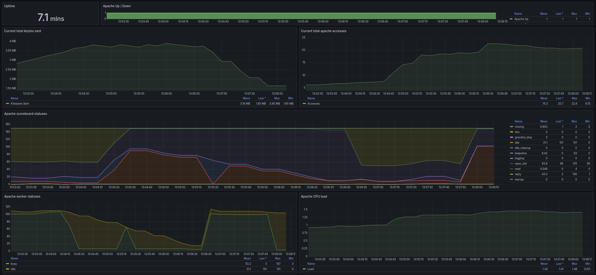

If you want more detailed information [click here](./config/monitoring/README.md)

## URL Shortener in action...

Try my own url shortener system in https://pumukydev.com/shortener/ . If you want short any link, just introduce it and you will get a shorter url for your video or page. There you can see an example:


If you want more detailed information [click here](./htdocs/shortener/README.md)

## Getting started

### Download

You can download the proyect with just one command:

```bash
git clone https://github.com/PumukyDev/web-server.git
```

### Configuration

After downloading the files you have to open your router ports for the machine's ip (default 192.168.1.202)

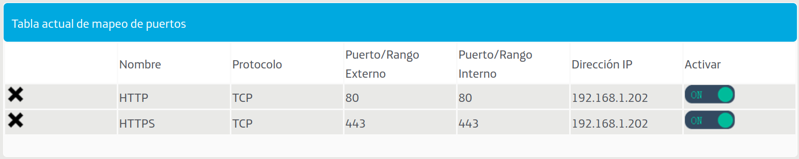

> [!WARNING]
> If your ip do not start with 192.168.1.X or it is in use, change the ip, just change the next line in the [Vagrantfile](Vagrantfile). You may also have to change the bridge connector (you can check it making a `ip a` in the terminal). If you have changed the ip, change it from the [hosts](./ansible/hosts) file too 


```ruby
s.vm.network "public_network", ip: "192.168.1.202", bridge: "enp4s0"
```

```
[server]
192.168.1.202 
ansible_ssh_user=vagrant
ansible_ssh_private_key_file=~/.ssh/id_rsa
ansible_port=2222
```


> [!IMPORTANT]
> If you don't have any ssh key, generate a new pair with `ssh-keygen -t rsa -b 4096`

Create a new .env file with your ionos api key, it is used to manage txt records [URL-shortener](./htdocs/shortener/README.md) and to configure the [Dynamic DNS](./config/dynamic-dns/README.md). Change "pumukydev" domain with your own domain

If you want to use HTTPS in you server, create a certs folder inside `config/apache2/` and paste your own ionos certification keys.


### Starting the server

To start the server, just make:

```bash
make up
```

To destroy the vm, try:

```bash
make clean
```

If you don't know if you have ansible or vagrant, try:

```bash
make validate
```


## Other

<details>
    <summary style="font-size: 20px"><b>Performance tests</b></summary><br/>

These tests are made with `ab`, which is a tool for benchmarking your Apache Hypertext Transfer Protocol (HTTP) server. It is designed to give you an impression of how  your  current  Apache installation  performs. This especially shows you how many requests per second your Apache installation is capable of serving.


<details>
    <summary style="font-size: 17.5px"><b>Normal tests</b></summary><br/>

### Parameters:

* `-k` : Enable the HTTP KeepAlive  feature,  i.e.,  perform  multiple  requests within one HTTP session. Default is no KeepAlive.

* `-c` (concurrency): Number of multiple requests to perform at a time Default is one request at a time.

* `-n` (requests): Number of requests to perform for the benchmarking session. The default is to just perform a single request which usually leads  to  non-repre‐ sentative benchmarking results.


### 100 users and 1000 requests


<details>
    <summary><b>Index page with SSL3 and TLS1.2</b></summary><br/>

Extra Parameters:

* `-f` (protocol): Specify SSL/TLS protocol (SSL2, TLS1, TLS1.1, TLS1.2, TLS1.3 or ALL)


```bash
ab -k -f SSL3 -c 100 -n 1000 https://pumukydev.com/
```

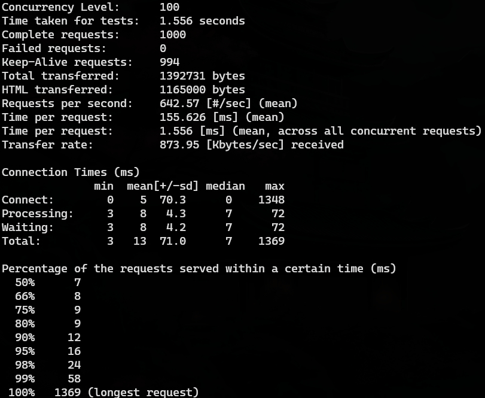

> [!NOTE]
> SSL3 is deprecated so apache use TLS1.3 automatically, so this test is made with TLS1.3 instead of SSL3 actually.

The test duration was **1.556 seconds**, during which all **1000 requests** were successfully completed with no failures. Out of those, **994 requests** reused connections, reducing overhead thanks to HTTP Keep-Alive.

On average, the server handled **642.57 requests per second**, with each individual request taking about **155.6 ms** to process. Considering all concurrent requests, the average request time dropped to **1.556 ms**. The server achieved a **transfer rate of 873.95 KB/s**, transferring a total of **1,392,731 bytes**, where **1,165,000 bytes** corresponded to the actual HTML content.

Connection times were broken down into phases:

* **Connection** was almost instantaneous, with a median of **0 ms**.  
* **Processing** the requests took **7 ms** on average.  
* **Waiting** time, the delay before receiving the first byte of the response, was also about **7 ms**.  

The final breakdown shows that **90% of the requests** were completed within **12 ms**, and **95% within 16 ms**. The **longest request** took **1369 ms** to complete.


```bash
ab -k -f TLS1.2 -c 100 -n 1000 https://pumukydev.com/
```


The test duration was **0.366 seconds**, during which **1,000 requests** were completed with **0 failures**. All **1,000 requests** reused connections, reducing overhead thanks to HTTP Keep-Alive.

On average, the server handled **2,732.69 requests per second**, with each individual request taking about **36.594 ms** to process. Considering all concurrent requests, the average request time dropped to **0.366 ms**. The server achieved a **transfer rate of 2,094.96 KB/s**, transferring a total of **785,030 bytes**, where **534,000 bytes** corresponded to the actual HTML content.

Connection times were broken down into phases:

* **Connection** was very fast, with a median of **0 ms**.  
* **Processing** the requests took **7 ms** on average.  
* **Waiting** time, the delay before receiving the first byte of the response, was about **7 ms**.  

The final breakdown shows that **90% of the requests** were completed within **8 ms**, and **95% within 66 ms**. The **longest request** took **107 ms** to complete.

</details>

<details>
    <summary><b>Logo.png image (1.1 MB)</b></summary><br/>

```bash
ab -k -c 100 -n 1000 https://pumukydev.com/logo.png
```

 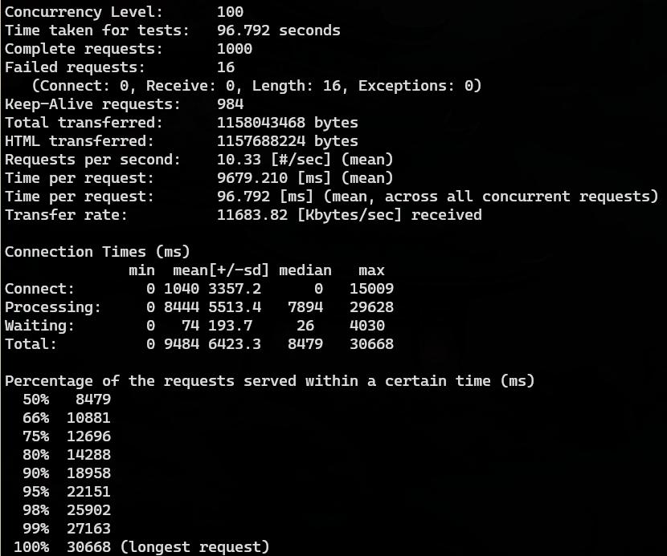

The test duration was **96.792 seconds**, during which **1000 requests** were completed with **16 failures**. Out of those, **984 requests** reused connections, reducing overhead thanks to HTTP Keep-Alive.

On average, the server handled **10.33 requests per second**, with each individual request taking about **9679.21 ms** to process. Considering all concurrent requests, the average request time dropped to **96.792 ms**. The server achieved a **transfer rate of 11,683.82 KB/s**, transferring a total of **115,804,346 bytes**, where **115,768,822 bytes** corresponded to the actual HTML content.

Connection times were broken down into phases:

* **Connection** was almost instantaneous, with a median of **0 ms**.  
* **Processing** the requests took **7894 ms** on average.  
* **Waiting** time, the delay before receiving the first byte of the response, was about **26 ms**.  

The final breakdown shows that **90% of the requests** were completed within **18,958 ms**, and **95% within 22,151 ms**. The **longest request** took **30,668 ms** to complete.

</details>

<details>
    <summary><b>Admin page with authentication</b></summary><br/>

Extra Parameters:

* `-A` (attribute): Add Basic WWW Authentication, the attributes are a colon separated username and password.

```bash
ab -k -c 100 -n 1000 https://pumukydev.com/admin/
```

 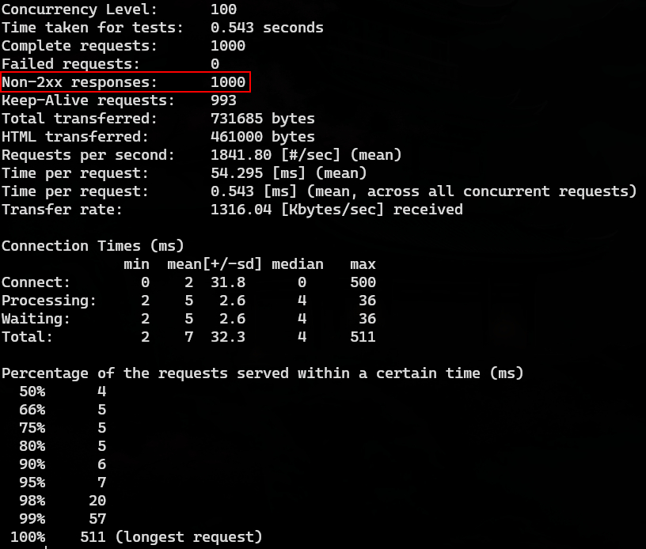

I will not explain this image in depth as I did not write the `-A` parameter in order to been authenticated. This was an example that the page authentication works perfectly as if you don't write the password, you can't get into the admin page.

```bash
ab -k -c 100 -n 1000 -A admin:asir https://pumukydev.com/admin/
```

 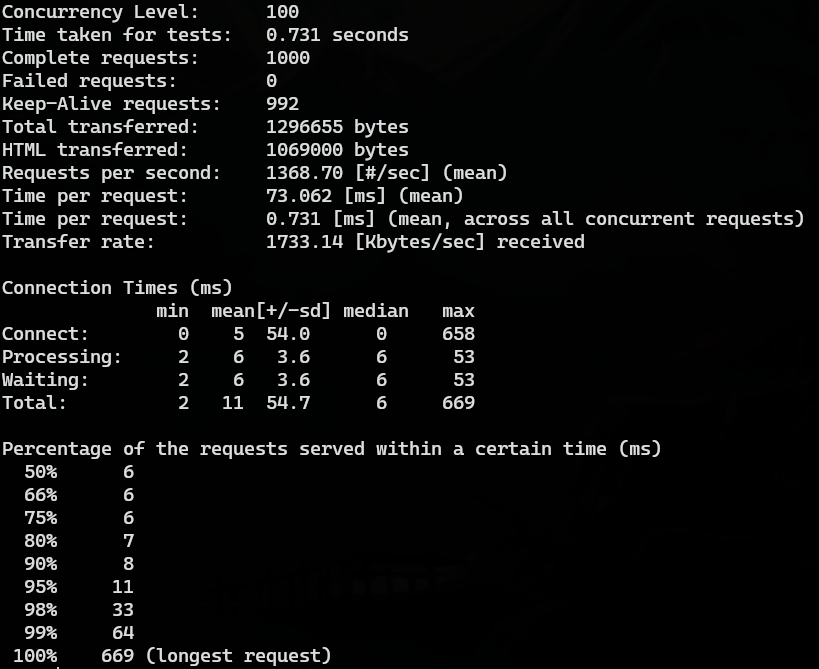

The test duration was **0.731 seconds**, during which **1000 requests** were completed with **0 failures**. Out of those, **992 requests** reused connections, reducing overhead thanks to HTTP Keep-Alive.

On average, the server handled **1368.70 requests per second**, with each individual request taking about **73.062 ms** to process. Considering all concurrent requests, the average request time dropped to **0.731 ms**. The server achieved a **transfer rate of 1733.14 KB/s**, transferring a total of **12,966,655 bytes**, where **1,060,000 bytes** corresponded to the actual HTML content.

Connection times were broken down into phases:

* **Connection** was extremely fast, with a median of **0 ms**.  
* **Processing** the requests took **6 ms** on average.  
* **Waiting** time, the delay before receiving the first byte of the response, was also about **6 ms**.  

The final breakdown shows that **90% of the requests** were completed within **8 ms**, and **95% within **11 ms**. The **longest request** took **669 ms** to complete.


</details>


### 1000 users and 10000 requests

<details>
    <summary><b>Index page with SSL3 and TLS1.2</b></summary><br/>

```bash
ab -k -f SSL3 -c 1000 -n 10000 https://pumukydev.com/
```

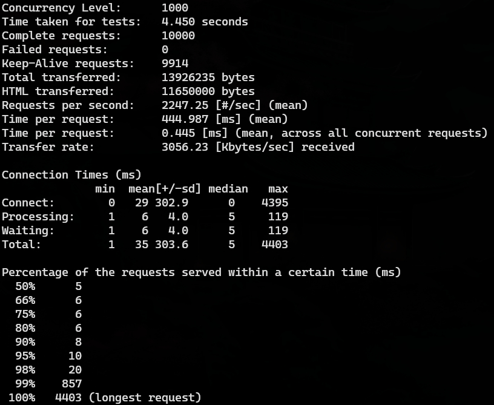

> [!NOTE]
> SSL3 is deprecated so apache use TLS1.3 automatically, so this test is made with TLS1.3 instead of SSL3 actually.

The test duration was **4.450 seconds**, during which **10,000 requests** were completed with **0 failures**. Out of those, **9,914 requests** reused connections, reducing overhead thanks to HTTP Keep-Alive.

On average, the server handled **2247.25 requests per second**, with each individual request taking about **444.99 ms** to process. Considering all concurrent requests, the average request time dropped to **0.445 ms**. The server achieved a **transfer rate of 3056.23 KB/s**, transferring a total of **13,926,235 bytes**, where **11,650,000 bytes** corresponded to the actual HTML content.

Connection times were broken down into phases:

- **Connection** was almost instantaneous, with a median of **0 ms**.  
- **Processing** the requests took **5 ms** on average.  
- **Waiting** time, the delay before receiving the first byte of the response, was about **5 ms**.  

The final breakdown shows that **90% of the requests** were completed within **8 ms**, and **95% within 10 ms**. The **longest request** took **4403 ms** to complete.


```bash
ab -k -f TLS1.2 -c 1000 -n 10000 https://pumukydev.com/
```

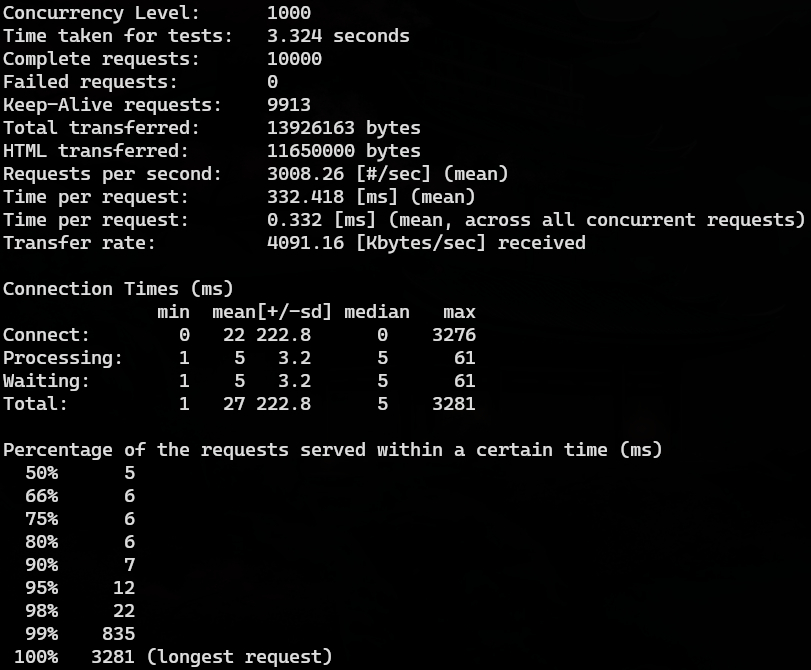

The test duration was **3.324 seconds**, during which **10,000 requests** were completed with **0 failures**. Out of those, **9,913 requests** reused connections, reducing overhead thanks to HTTP Keep-Alive.

On average, the server handled **3,008.26 requests per second**, with each individual request taking about **332.418 ms** to process. Considering all concurrent requests, the average request time dropped to **0.332 ms**. The server achieved a **transfer rate of 4,091.16 KB/s**, transferring a total of **13,926,163 bytes**, where **11,650,000 bytes** corresponded to the actual HTML content.

Connection times were broken down into phases:

* **Connection** was efficient, with a median of **0 ms**.  
* **Processing** the requests took **5 ms** on average.  
* **Waiting** time, the delay before receiving the first byte of the response, was about **5 ms**.  

The final breakdown shows that **90% of the requests** were completed within **7 ms**, and **95% within 12 ms**. The **longest request** took **3,281 ms** to complete.

</details>

<details>
    <summary><b>Logo.png image (1.1 MB)</b></summary><br/>

```bash
ab -k -c 1000 -n 10000 https://pumukydev.com/logo.png
```


The test duration was **247.758 seconds**, during which **10,000 requests** were completed with **15,936 failures**. Out of those, **1,838 requests** reused connections, reducing overhead thanks to HTTP Keep-Alive.

On average, the server handled **40.36 requests per second**, with each individual request taking about **24,775.850 ms** to process. Considering all concurrent requests, the average request time dropped to **24.776 ms**. The server achieved a **transfer rate of 9171.53 KB/s**, transferring a total of **2,326,859,198 bytes**, where **2,326,089,130 bytes** corresponded to the actual HTML content.

Connection times were broken down into phases:

* **Connection** had a median of **0 ms**, with a mean of **2170 ms** and a maximum of **196,890 ms**.  
* **Processing** the requests took **25588.7 ms** on average, with a median of **7 ms**.  
* **Waiting** time, the delay before receiving the first byte of the response, was about **0 ms** on median, with a maximum of **7228 ms**.  

The final breakdown shows that **90% of the requests** were completed within **21,115 ms**, and **95% within 80,639 ms**. The **longest request** took **210,532 ms** to complete.

 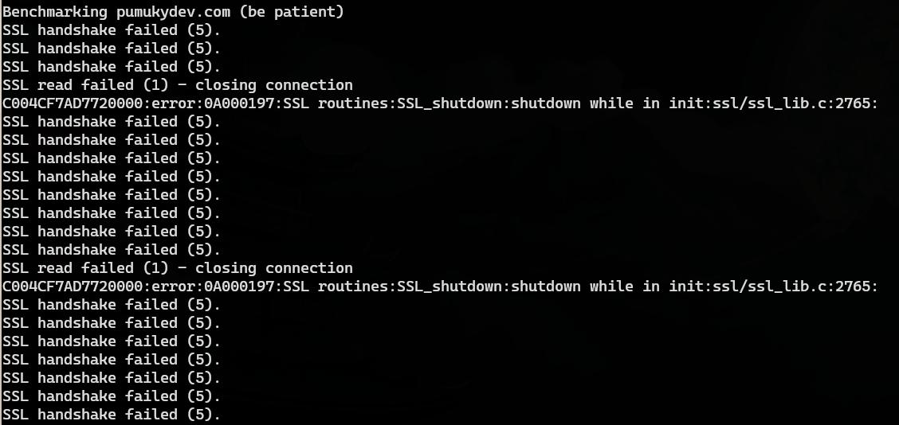

In the previous image we can see many errors and problems as after asking for the image so many times, we get The SSL handshake failed and SSL_shutdown errors indicate that the web server could not handle the number of concurrent SSL connections requested.


</details>

<details>
    <summary><b>Admin page with authentication</b></summary><br/>

```bash
ab -k -c 1000 -n 10000 -A admin:asir https://pumukydev.com/admin/
```

 

**The test duration was 4.217 seconds**, during which **10,000 requests** were completed with **0 failures**. Out of those, **9,913 requests** reused connections, reducing overhead thanks to HTTP Keep-Alive.

On average, the server handled **2,371.32 requests per second**, with each individual request taking about **421.706 ms** to process. Considering all concurrent requests, the average request time dropped to **0.422 ms**. The server achieved a **transfer rate of 3,002.63 KB/s**, transferring a total of **12,966,172 bytes**, where **10,690,000 bytes** corresponded to the actual HTML content.

Connection times were broken down into phases:

- **Connection** was almost instantaneous, with a median of **0 ms**.  
- **Processing** the requests took **6 ms** on average.  
- **Waiting** time, the delay before receiving the first byte of the response, was about **2.6 ms**.  

The final breakdown shows that **90% of the requests** were completed within **7 ms**, and **95% within 8 ms**. The **longest request** took **4,159 ms** to complete.


</details>

<br/>

---

<br/>

</details>


<details>
    <summary style="font-size: 17.5px"><b>Compression tests</b></summary><br/>

### Parameters:

* `-k` : Enable the HTTP KeepAlive  feature,  i.e.,  perform  multiple  requests within one HTTP session. Default is no KeepAlive.

* `-c` (concurrency): Number of multiple requests to perform at a time Default is one request at a time.

* `-n` (requests): Number of requests to perform for the benchmarking session. The default is to just perform a single request which usually leads  to  non-repre‐ sentative benchmarking results.

* `-H` (custom-header): Append extra headers to the request. The argument is typically  in  the form  of  a valid header line, containing a colon-separated field-value pair (i.e., "Accept-Encoding: zip/zop;8bit" or "Accept-Encoding: gzip, deflate")


### 100 users and 1000 requests

<details>
    <summary><b>Index page with SSL3 and TLS1.2</b></summary><br/>

```bash
ab -k -f SSL3 -c 100 -n 1000 -H "Accept-Encoding: gzip, deflate" https://pumukydev.com/
```

> [!NOTE]
> SSL3 is deprecated so apache use TLS1.3 automatically, so this test is made with TLS1.3 instead of SSL3 actually.

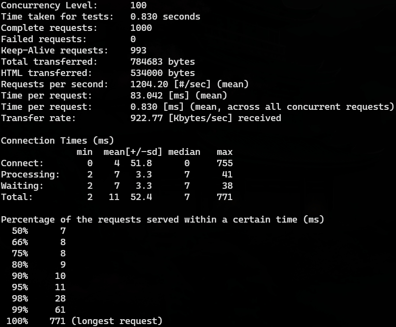

**The test duration was 0.830 seconds**, during which **1,000 requests** were completed with **0 failures**. Out of those, **993 requests** reused connections, reducing overhead thanks to HTTP Keep-Alive.

On average, the server handled **1,204.20 requests per second**, with each individual request taking about **83.042 ms** to process. Considering all concurrent requests, the average request time dropped to **0.830 ms**. The server achieved a **transfer rate of 922.77 KB/s**, transferring a total of **784,683 bytes**, where **534,000 bytes** corresponded to the actual HTML content.

Connection times were broken down into phases:

- **Connection** was almost instantaneous, with a median of **0 ms**.  
- **Processing** the requests took **7 ms** on average.  
- **Waiting** time, the delay before receiving the first byte of the response, was about **3.3 ms**.  

The final breakdown shows that **90% of the requests** were completed within **9 ms**, and **95% within 11 ms**. The **longest request** took **771 ms** to complete.


```bash
ab -k -f TLS1.2 -c 100 -n 1000 -H "Accept-Encoding: gzip, deflate" https://pumukydev.com/
```

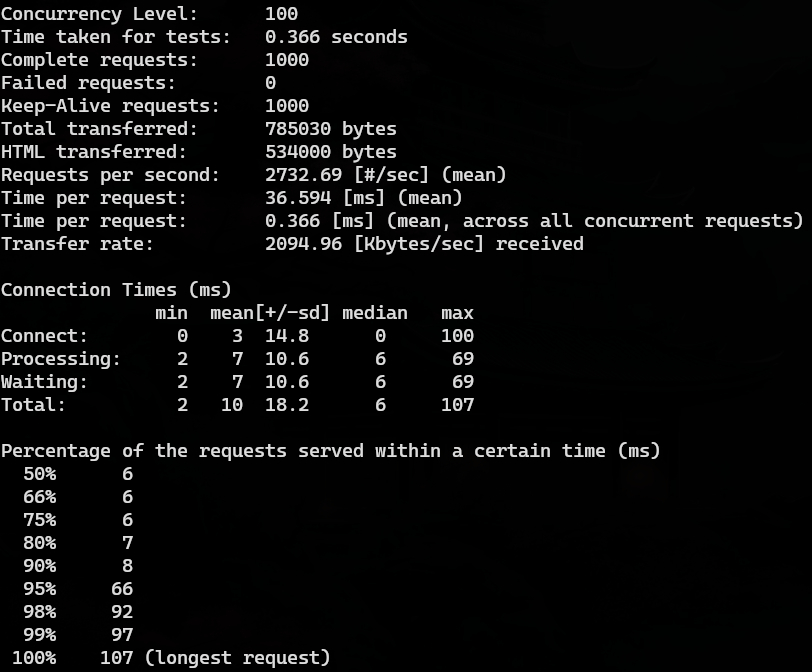


The test duration was **0.366 seconds**, during which **1,000 requests** were completed with **0 failures**. Out of those, **1,000 requests** reused connections, reducing overhead thanks to HTTP Keep-Alive.

On average, the server handled **2,732.69 requests per second**, with each individual request taking about **36.59 ms** to process. Considering all concurrent requests, the average request time dropped to **0.366 ms**. The server achieved a **transfer rate of 20,494.96 KB/s**, transferring a total of **785,030 bytes**, where **534,000 bytes** corresponded to the actual HTML content.

Connection times were broken down into phases:

* **Connection** was almost instantaneous, with a median of **0 ms**.  
* **Processing** the requests took **7 ms** on average.  
* **Waiting** time, the delay before receiving the first byte of the response, was about **7 ms**.  

The final breakdown shows that **90% of the requests** were completed within **8 ms**, and **95% within 66 ms**. The **longest request** took **107 ms** to complete.


</details>

<details>
    <summary><b>Logo.png image (1.1 MB)</b></summary><br/>

```bash
ab -k -c 100 -n 1000 -H "Accept-Encoding: gzip, deflate" https://pumukydev.com/logo.png
```

 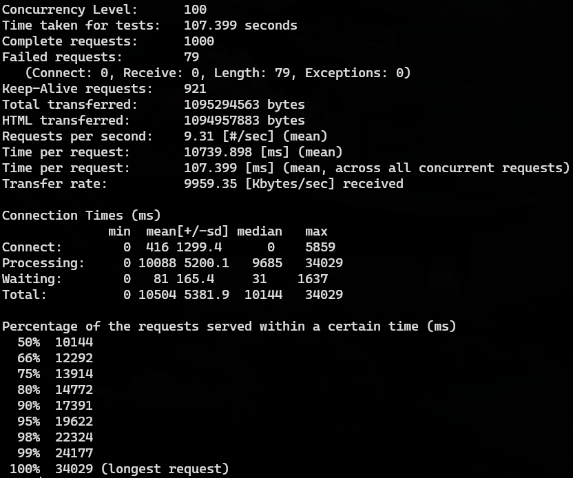

**The test duration was 107.399 seconds**, during which **1,000 requests** were completed with **79 failures**. The failures were due to **length mismatches**, with no connection or reception errors. Out of those, **921 requests** reused connections, reducing overhead thanks to HTTP Keep-Alive.

On average, the server handled **9.31 requests per second**, with each individual request taking about **10,739.898 ms** to process. Considering all concurrent requests, the average request time dropped to **107.399 ms**. The server achieved a **transfer rate of 9,959.35 KB/s**, transferring a total of **10,952,94563 bytes**, where **10,949,57883 bytes** corresponded to the actual HTML content.

Connection times were broken down into phases:

- **Connection** was nearly instantaneous, with a median of **0 ms**.  
- **Processing** the requests took **9,685 ms** on average.  
- **Waiting** time, the delay before receiving the first byte of the response, was about **31 ms**.  

The final breakdown shows that **90% of the requests** were completed within **17,391 ms**, and **95% within 19,622 ms**. The **longest request** took **34,029 ms** to complete.


</details>

<details>
    <summary><b>Admin page with authentication</b></summary><br/>

```bash
ab -k -c 100 -n 1000 -A admin:asir -H "Accept-Encoding: gzip, deflate" https://pumukydev.com/admin/
```

 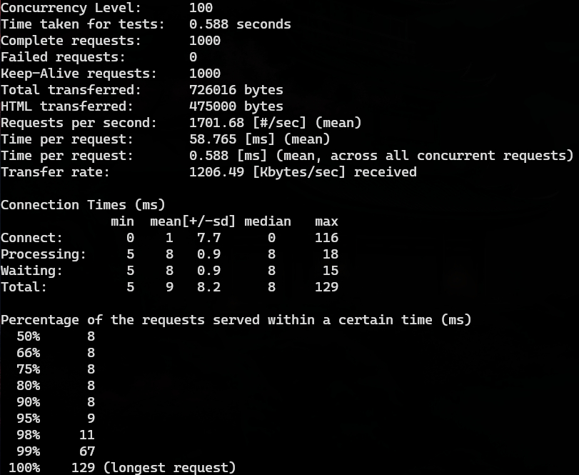

The test duration was **0.588 seconds**, during which **1000 requests** were completed with **0 failures**. Out of those, **1000 requests** reused connections, reducing overhead thanks to HTTP Keep-Alive.

On average, the server handled **1701.68 requests per second**, with each individual request taking about **58.765 ms** to process. Considering all concurrent requests, the average request time dropped to **0.588 ms**. The server achieved a **transfer rate of 1206.49 KB/s**, transferring a total of **720,016 bytes**, where **475,000 bytes** corresponded to the actual HTML content.

Connection times were broken down into phases:

* **Connection** was almost instantaneous, with a median of **0 ms**.  
* **Processing** the requests took **8 ms** on average.  
* **Waiting** time, the delay before receiving the first byte of the response, was about **8 ms**.  

The final breakdown shows that **99% of the requests** were completed within **67 ms**, and **100% within 129 ms**. The **longest request** took **129 ms** to complete.


</details>


### 1000 users and 10000 requests

<details>
    <summary><b>Index page with SSL3 and TLS1.2</b></summary><br/>

```bash
ab -k -f SSL3 -c 1000 -n 10000 -H "Accept-Encoding: gzip, deflate" https://pumukydev.com/
```

> [!NOTE]
> SSL3 is deprecated so apache use TLS1.3 automatically, so this test is made with TLS1.3 instead of SSL3 actually.

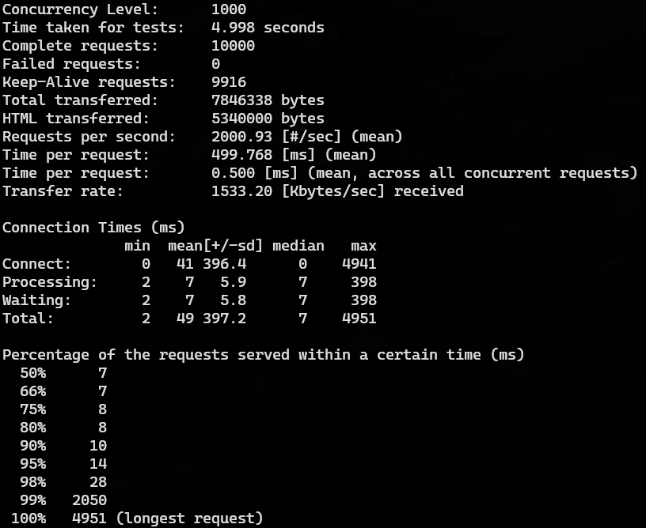

The test duration was **4.998 seconds**, during which **10,000 requests** were completed with **0 failures**. Out of those, **9,916 requests** reused connections, reducing overhead thanks to HTTP Keep-Alive.

On average, the server handled **2000.93 requests per second**, with each individual request taking about **499.768 ms** to process. Considering all concurrent requests, the average request time dropped to **0.500 ms**. The server achieved a **transfer rate of 1533.20 KB/s**, transferring a total of **7,846,338 bytes**, where **5,340,000 bytes** corresponded to the actual HTML content.

Connection times were broken down into phases:

* **Connection** was fast, with a median of **0 ms**.  
* **Processing** the requests took **7 ms** on average.  
* **Waiting** time, the delay before receiving the first byte of the response, was about **7 ms**.  

The final breakdown shows that **99% of the requests** were completed within **2050 ms**, and **100% within 4951 ms**. The **longest request** took **4951 ms** to complete.


```bash
ab -k -f TLS1.2 -c 1000 -n 10000 -H "Accept-Encoding: gzip, deflate" https://pumukydev.com/
```


The test duration was **2.600 seconds**, during which **10,000 requests** were completed with **0 failures**. Out of those, **9,916 requests** reused connections, reducing overhead thanks to HTTP Keep-Alive.

On average, the server handled **3,834.26 requests per second**, with each individual request taking about **260.81 ms** to process. Considering all concurrent requests, the average request time dropped to **0.261 ms**. The server achieved a **transfer rate of 2,937.97 KB/s**, transferring a total of **7,846,310 bytes**, where **5,340,000 bytes** corresponded to the actual HTML content.

Connection times were broken down into phases:

* **Connection** was almost instantaneous, with a median of **0 ms**.  
* **Processing** the requests took **3 ms** on average.  
* **Waiting** time, the delay before receiving the first byte of the response, was about **3 ms**.  

The final breakdown shows that **90% of the requests** were completed within **7 ms**, and **95% within 9 ms**. The **longest request** took **2,568 ms** to complete.

</details>

<details>
    <summary><b>Logo.png image (1.1 MB)</b></summary><br/>

```bash
ab -k -c 1000 -n 10000 -H "Accept-Encoding: gzip, deflate" https://pumukydev.com/logo.png
```

 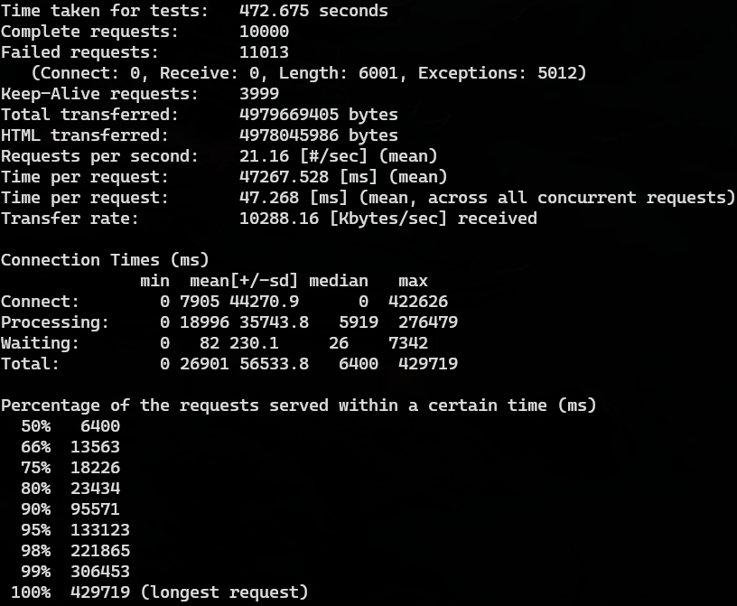

The test duration was **472.675 seconds**, during which **10,000 requests** were completed with **11,013 failures**. Out of those, **3,999 requests** reused connections, reducing overhead thanks to HTTP Keep-Alive.

On average, the server handled **21.16 requests per second**, with each individual request taking about **47,267.528 ms** to process. Considering all concurrent requests, the average request time dropped to **47.268 ms**. The server achieved a **transfer rate of 10,288.16 KB/s**, transferring a total of **4,979,669,405 bytes**, where **4,978,045,986 bytes** corresponded to the actual HTML content.

Connection times were broken down into phases:

* **Connection** took a median of **0 ms**, with an average of **7,905 ms**.  
* **Processing** the requests took **35,743 ms** on average.  
* **Waiting** time, the delay before receiving the first byte of the response, was about **230 ms**.  

The final breakdown shows that **90% of the requests** were completed within **95,571 ms**, and **100% within 429,719 ms**. The **longest request** took **429,719 ms** to complete.

 

In the previous image we can see many errors and problems as after asking for the image so many times, we get The SSL handshake failed and SSL_shutdown errors indicate that the web server could not handle the number of concurrent SSL connections requested.

</details>

<details>
    <summary><b>Admin page with authentication</b></summary><br/>

```bash
ab -k -c 1000 -n 10000 -A admin:asir -H "Accept-Encoding: gzip, deflate" https://pumukydev.com/admin/
```

 

The test duration was **5.838 seconds**, during which **10,000 requests** were completed with **0 failures**. Out of those, **9,990 requests** reused connections, reducing overhead thanks to HTTP Keep-Alive.

On average, the server handled **1,712.94 requests per second**, with each individual request taking about **583.793 ms** to process. Considering all concurrent requests, the average request time dropped to **0.584 ms**. The server achieved a **transfer rate of 1,213.78 KB/s**, transferring a total of **7,256,015 bytes**, where **4,750,000 bytes** corresponded to the actual HTML content.

Connection times were broken down into phases:

* **Connection** was nearly instantaneous, with a median of **0 ms**.  
* **Processing** the requests took **8 ms** on average.  
* **Waiting** time, the delay before receiving the first byte of the response, was about **8 ms**.  

The final breakdown shows that **90% of the requests** were completed within **9 ms**, and **95% within 9 ms**. The **longest request** took **5,803 ms** to complete.

</details>

<br/>

---

<br/>

</details>

<details>
    <summary style="font-size: 17.5px"><b>Conclusion</b></summary><br/>

Overall, the server has demonstrated excellent performance during the tests, completing all requests with consistent response times and no failures, except in specific scenarios. 

The system successfully handled the majority of tests under different levels of load, maintaining high efficiency in data transfer and effectively utilizing Keep-Alive connections to reduce overhead. Additionally, the server performed exceptionally well when tested with the `-H` parameter for compression, showing its capability to optimize resource delivery under compressed headers.

However, specific issues were identified in the image tests, particularly those involving **10,000 simultaneous requests**, where higher response times and a significant number of failures were observed. This behavior might indicate bottlenecks in handling static content or limitations in the server's configuration to handle high concurrency in these specific cases.

</details>

<br/>

---

<br/>


</details>


<details>
    <summary style="font-size: 20px"><b>File structure</b></summary><br/>


This is the my proyect file structure:

```
.
├── apache_exporter.service
├── compose.yml
├── config
│   ├── apache2
│   │   ├── apache2.conf
│   │   ├── certs
│   │   │   ├── intermediate
│   │   │   │   ├── intermediate1.cer
│   │   │   │   └── intermediate2.cer
│   │   │   ├── _.pumukydev.com_private_key.key
│   │   │   └── pumukydev.com_ssl_certificate.cer
│   │   └── sites-available
│   │       └── pumukydev.conf
│   ├── dynamic-dns
│   │   ├── dyndns-cronjob
│   │   ├── get_url
│   │   │   └── dyndns.sh
│   │   └── README.md
│   └── monitoring
│       ├── grafana
│       │   ├── dashboard.json
│       │   ├── dashboard.yml
│       │   ├── datasources.yml
│       │   └── grafana.ini
│       ├── images
│       │   ├── grafana_change_passwd.jpg
│       │   ├── grafana_connections.jpg
│       │   ├── grafana_graph.jpg
│       │   ├── grafana_login.jpg
│       │   ├── grafana_prometheus.jpg
│       │   ├── prometheus_add_source.jpg
│       │   ├── prometheus_settings.jpg
│       │   └── prometheus_succed.jpg
│       ├── prometheus
│       │   └── prometheus.yml
│       └── README.md
├── htdocs
│   ├── admin
│   │   └── index.phpweb-server
│   │   ├── footer.php
│   │   └── header.php
│   ├── index.php
│   ├── logo.png
│   ├── shortener
│   │   ├── get_long_url.sh
│   │   ├── get_txt.sh
│   │   ├── get_zoneId.sh
│   │   ├── index.php
│   │   ├── post_txt.sh
│   │   ├── redirect.php
│   │   └── urlshortener.php
│   ├── status
│   │   └── index.php
│   ├── style
│   │   └── style.css
│   └── tools
│       └── index.php
├── playbooks
│   ├── main.yml
│   ├── tasks
│   │   ├── apache.yml
│   │   ├── dyndns.yml
│   │   └── monitoring.yml
│   └── vars
├── README.md
└── Vagrantfile
```
</details>

## License

This project is licensed under the **Apache License 2.0**. See the [LICENSE](LICENSE) file for details.

## Contribute

Want to contribute? There are multiple ways you can contribute to this project. Here are some ideas:

* 📃 [Translate the web into multiple languages!](./CONTRIBUTING.md#translations)
* 🐛 [Fix some easy issues](CONTRIBUTING.md#Reporting-Issues)
* 💡 [Or check out some other issues](CONTRIBUTING.md#Reporting-Issues) (or translate them).

