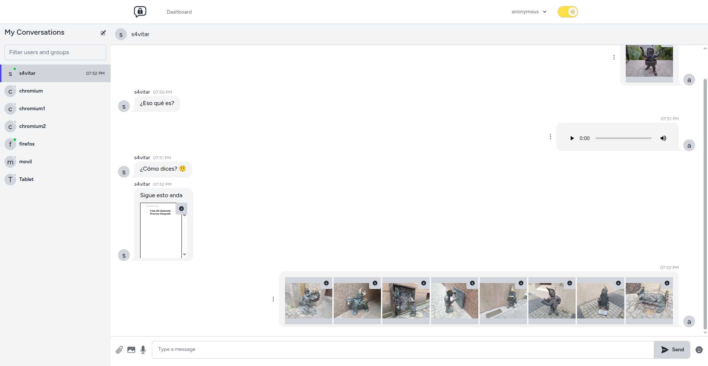

# PumukyChat

## Introduction

**PumukyChat** is a secure, real-time messaging platform built with Laravel and React. It focuses on privacy-first communication by implementing end-to-end encryption with RSA and AES, ensuring that only users can read their messages — not even the server.

The app supports group chats, file attachments, dark/light themes, and mobile responsiveness out of the box.

## Preview

## Key Features

- 🔒 **End-to-end encryption** with hybrid RSA + AES system.
- 💬 **Real-time messaging** using Laravel Reverb and WebSockets.
- 📁 **Secure file sharing** with encrypted attachments.
- 🌗 **Responsive dark/light themes** for a smooth UX.
- 📦 **Dockerized deployment** with automatic HTTPS, CI/CD, and backups.

## Documentation

For full technical details, setup instructions, and implementation design, view the [full documentation here](https://pumukydev.github.io/pi-pumukychat) or download it in [PDF format](https://github.com/PumukyDev/pi-pumukychat/blob/gh-pages/2ASIR_B_BERTOS_GOMEZ_ADRIAN_PUMUKYCHAT.pdf).

## License

This project is licensed under the [Apache License 2.0](https://www.apache.org/licenses/LICENSE-2.0).
