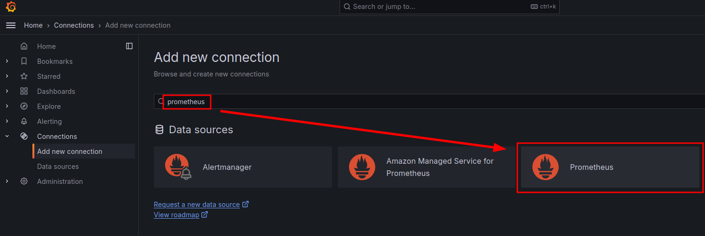
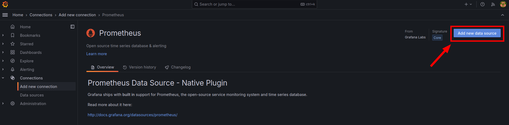
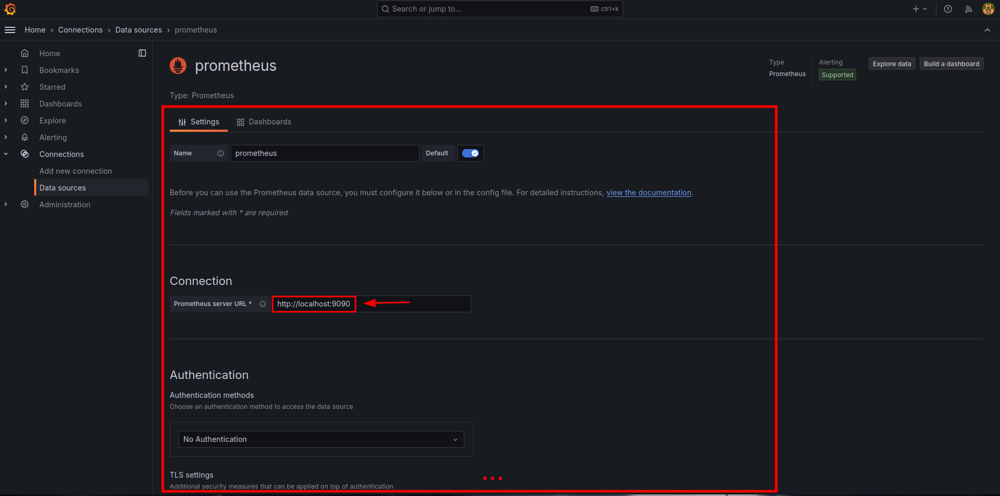
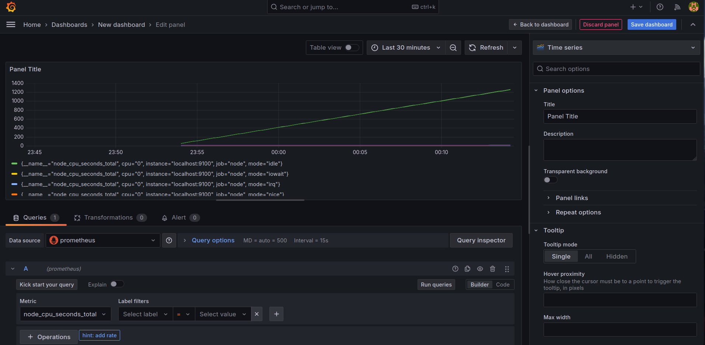

# Monitoring

This folder contains configurations and files for the monitoring tools used in the project. It includes setups for **Grafana** and **Prometheus**, with a flexible structure that allows easy integration of additional tools such as Loki, Suricata, and more in the future.


---

## Tools Included

### 1. Grafana
Grafana is a data visualization and analytics platform that allows you to monitor and analyze metrics from systems, applications, and services in real time.

#### **Key Features:**
- **Visualization:** Interactive and customizable dashboards with graphs, tables, and heatmaps.
- **Integration:** Seamless support for data sources such as Prometheus, Loki, Elasticsearch, and others.
- **Alerting:** Configure alerts based on specific conditions to notify through email, Slack, or other channels.
- **Extensibility:** Support for plugins, pre-built dashboards, and community-shared panels.

#### **Configuration Files:**
- **`grafana.ini`**: The main configuration file for Grafana. Includes settings for server, authentication, and plugins.
- **`dashboard.yml`**: Configures default dashboards to be loaded automatically upon startup.
- **`datasources.yml`**: Defines the data sources used by Grafana, such as Prometheus.
- **`dashboard.json`**: A pre-configured dashboard template for visualizing metrics.

#### **Access URL:**
After starting the Grafana service, it is accessible at:
http://localhost:3000


---

### 2. Prometheus
Prometheus is a powerful monitoring and alerting toolkit optimized for time-series data. It collects and stores metrics, allowing users to query and create visualizations in Grafana.

#### **Configuration File:**
- **`prometheus.yml`**: The main configuration file for Prometheus, defining scrape targets and alert rules.

---

## Structure

- **`grafana/`**: Contains Grafana's configuration files and predefined dashboards.
- **`images/`**: Screenshots to document this README.md with Grafana, Prometheus and Apache exporter configurations
- **`prometheus/`**: Holds Prometheus configuration files.

---

## Installation and Setup

<details>
    <summary><b>Graphical Installation</b></summary><br/>
To configure monitoring tools using the graphical interface, follow these steps:

1. **Login to Grafana**: (Default user: admin,  passsword: admin)
   <div align="center">
       
   </div>

2. **Change Default Password**:
   <div align="center">
       
   </div>

3. **Add Prometheus as a Data Source**:
   <div align="center">
       
   </div>

4. **Configure Prometheus in Grafana**:
   <div align="center">
       
   </div>
   <div align="center">
       
   </div>

5. **Verify Setup**: 
   Once the setup is complete, a successful connection will look like this:
   <div align="center">
       
   </div>

6. **View Dashboards**:
   Use pre-configured dashboards or create your own:
   <div align="center">
       
   </div>
</details>


<details>
    <summary><b>Script Installation</b></summary><br/>
In this proyect we are automating installation with vagrant + ansible so there are some configuration files that have to be copied.

In order to configure prometheus with apache:


1. Add a route to storage the grafana dashboards in [dashboard.yml](./grafana/dashboard.yml)

   ```yml
   providers:
      - name: "default"
      orgId: 1
      folder: ""
      type: "file"
      disableDeletion: false
      updateIntervalSeconds: 10
      options:
         path: "/var/lib/grafana/dashboards"
   ```

2. Add prometheus add a data source in [datasources.yml](./grafana/datasources.yml)

   ```yml
   datasources:
      - name: Prometheus
      type: prometheus
      access: proxy
      url: http://localhost:9090
      isDefault: true
      jsonData:
         timeInterval: "10s"
   ```
3. Write this at the end of [prometheus.yml](./prometheus/prometheus.yml)

   ```yml
     - job_name: apache1
       static_configs:
         - targets: ['localhost:9117']
         labels:
            alias: my-apache-server
   ```
4. Install other tools like apache-exporter if you want more server information

5. Then you can configure your own dashboard in [dashboard.json](./grafana/dashboard.json)

</details>

---

### **Automated Installation**
This project leverages **Vagrant** and **Ansible** for automation. The monitoring stack is pre-configured to run perfectly in the development environment.

1. **Set up environment**:
   Ensure Vagrant and Ansible are properly installed on your system.

2. **Run provisioning**:
   Execute the following command to start the virtual machines and set up monitoring tools automatically:
   ```bash
   make up
   ```

   If you are not sure if  you have ansible and vagrant installed you can also try:
      ```bash
      make validate
      ```

### Access the Tools

- **Grafana**: [http://localhost:3000](http://localhost:3000)
- **Prometheus**: [http://localhost:9090](http://localhost:9090)

---

## Future Additions

- **Loki**: For log aggregation.
- **Suricata**: For intrusion detection.

This structure ensures flexibility and scalability to accommodate further enhancements.


