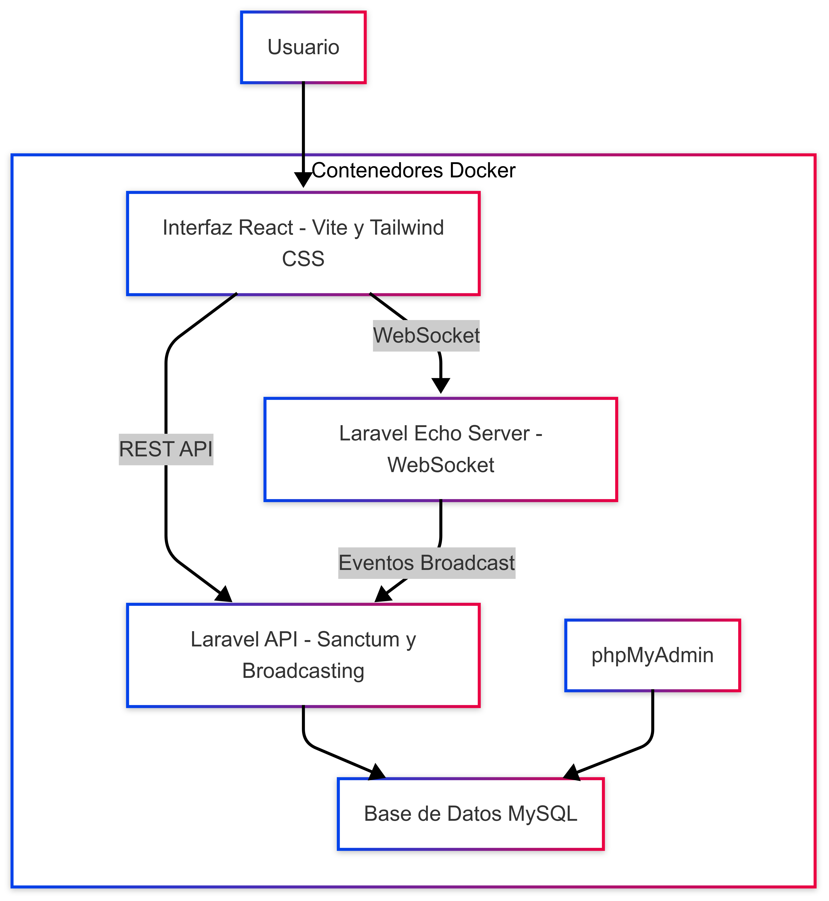

= PumukyChat
:author: Adrián Bertos Gómez
:revdate: 2025-04-15
:toc: left
:doctype: book

== Introducción

PumukyChat es una aplicación de mensajería en tiempo real que permite a los usuarios comunicarse de forma segura. Este proyecto nace del reto de aplicar y ampliar todo lo aprendido durante el curso. La aplicación se desplegará de forma automática y se encargará de gestionar todos los aspectos de un sistema de chat moderno.

== Objetivos del Proyecto

*Desarrollo funcional y seguro de una plataforma de chat en tiempo real con las siguientes metas:*

- **Comunicación instantánea:** Permitir chats individuales y grupales con alta fiabilidad y baja latencia.
- **Seguridad y encriptación:** Se evalua la implementación de cifrado de extremo a extremo para proteger la privacidad de las comunicaciones.
- **Interfaz de usuario adaptable:** Proveer una experiencia moderna, intuitiva y responsive, adaptable a distintos dispositivos.
- **Despliegue automatizado:** Facilitar la integración continua y la escalabilidad mediante contenedores Docker.
- **Uso de tecnologías modernas:** Profundizar en tecnologías actuales como Laravel, React, Vite, Tailwind CSS y WebSockets.

== Descripción General del Sistema

- **Frontend:** Aplicación desarrollada en React, utilizando Vite y Tailwind CSS para el diseño. Este módulo se encarga de la interfaz del usuario, implementando interacciones dinámicas y comunicándose con el backend mediante API REST y WebSockets.
- **Backend:** API basada en Laravel 11, que gestiona la lógica del chat, la autenticación (con Sanctum), el almacenamiento de datos y el broadcasting de eventos mediante Laravel Echo. Además, se contempla la posibilidad de implementar cifrado de extremo a extremo para los mensajes.
- **Base de Datos:** Se utiliza MariaDB para almacenar la información relacionada con usuarios, mensajes, grupos y las relaciones existentes entre ellos.
- **Infraestructura de Despliegue:** Todo el sistema se despliega mediante Docker, utilizando Docker Compose para orquestar de forma automática cada uno de los servicios (frontend, backend y base de datos).

== Arquitectura de la Solución

La solución sigue una arquitectura cliente-servidor donde se separan por completo las responsabilidades de frontend y backend. La comunicación se da a través de API REST y conexiones WebSocket para la mensajería en tiempo real. La orquestación con Docker Compose garantiza un despliegue automatizado y la portabilidad del sistema.

== Tecnologías y Herramientas

* **Frontend:**
** *React*: Librería de JavaScript para construir interfaces de usuario basadas en componentes.
** *Vite*: Herramienta de desarrollo y bundling que acelera el proceso de construcción.
** *Tailwind CSS*: Framework CSS para diseñar interfaces modernas y responsivas.
** *Axios*: Cliente HTTP para la comunicación con el backend.
** *Laravel Echo + WebSockets*: Implementación de comunicación en tiempo real entre el cliente y el servidor.

* **Backend:**
** *Laravel 11*: Framework PHP que gestiona la lógica de negocio, autenticación y persistencia.
** *Sanctum*: Sistema de autenticación basado en tokens para asegurar la comunicación de la API.
** *Eloquent ORM*: Facilita la interacción con la base de datos.
** *Laravel Broadcasting*: Permite la emisión de eventos en tiempo real utilizando Pusher o Laravel WebSockets.

* **DevOps y despliegue:**
** *Docker & Docker Compose*: Contenerización y orquestación de la aplicación para un despliegue automático, escalable y reproducible.
** *Git & GitHub*: Control de versiones del proyecto e integración continua de la documentación.
** *Composer y npm*: Gestores de dependencias para PHP y JavaScript respectivamente.

== Esquema de Base de Datos

El modelo de datos está diseñado para garantizar la escalabilidad y seguridad de las comunicaciones. Las principales entidades incluyen:

- **users**: Almacena la información de los usuarios (id, name, email, password, created_at, updated_at).
- **messages**: Registra los mensajes enviados, con campos como id, sender_id, receiver_id (o group_id para chats grupales), body y timestamps.
- **groups**: Contiene la información de los grupos de chat.
- **group_user**: Tabla pivote para gestionar las relaciones muchos a muchos entre usuarios y grupos.

== Funcionalidades Principales

- **Autenticación y gestión de usuarios:** Registro, inicio de sesión y manejo seguro de sesiones mediante tokens.
- **Chat en tiempo real:** Soporte para comunicación individual y grupal a través de WebSockets. Sin necesidad de recargar la página.
- **Cifrado de mensajes (Opcional):** Se está considerando la implementación de cifrado de extremo a extremo para asegurar la privacidad.
- **Notificaciones en tiempo real:** Actualización instantánea de la interfaz ante nuevos mensajes y eventos. Emitir notificaciones de estos.
- **Historial y persistencia:** Almacenamiento de conversaciones y capacidad de carga de mensajes anteriores poco a poco sin saturar el servidor.
- **Interfaz responsive:** Diseño optimizado para dispositivos móviles y de escritorio gracias a Tailwind CSS.

== Servicios Adicionales

- **Broadcasting de eventos:** Emisión de eventos en tiempo real para una experiencia de usuario fluida.
- **Verificación y seguridad adicional:** Opciones para la verificación de emails y medidas de seguridad avanzadas.
- **Despliegue continuo:** Automatización del despliegue con Docker Compose, permitiendo una integración y actualización constantes.
- **Monitoreo y logging:** Implementación de herramientas de seguimiento para el rendimiento y detección temprana de incidencias.
- **Personalización de la interfaz:** Soporte para modos oscuro y claro, adaptándose a las preferencias del usuario.

== Conclusión

PumukyChat es una plataforma de mensajería en tiempo real que integra un frontend en React y un backend en Laravel, desplegados de forma automatizada con Docker. Esta solución facilita la configuración, el mantenimiento y la escalabilidad del sistema, demostrando los conocimientos adquiridos durante el curso y estableciendo una base clara para futuras mejoras y adaptaciones.