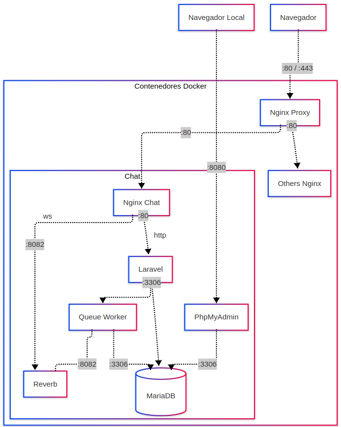
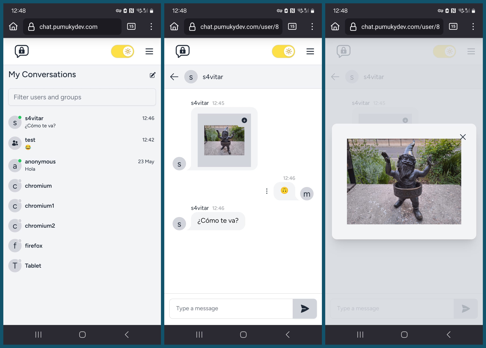
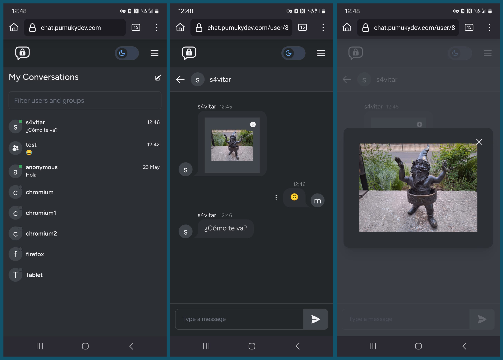
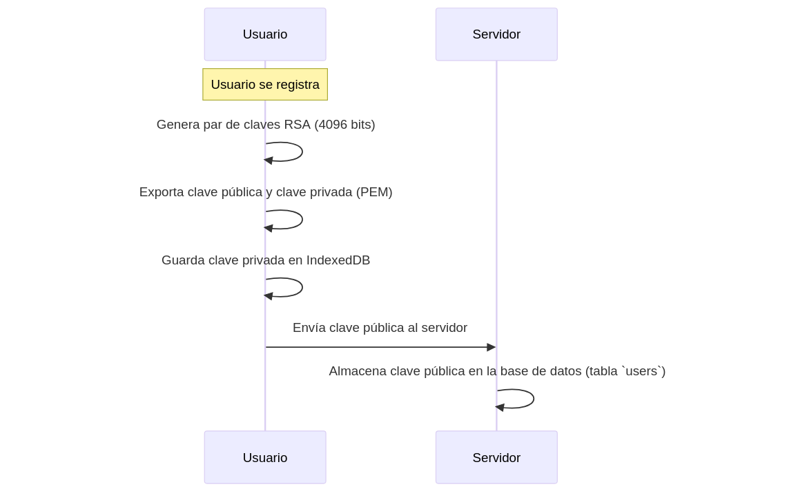
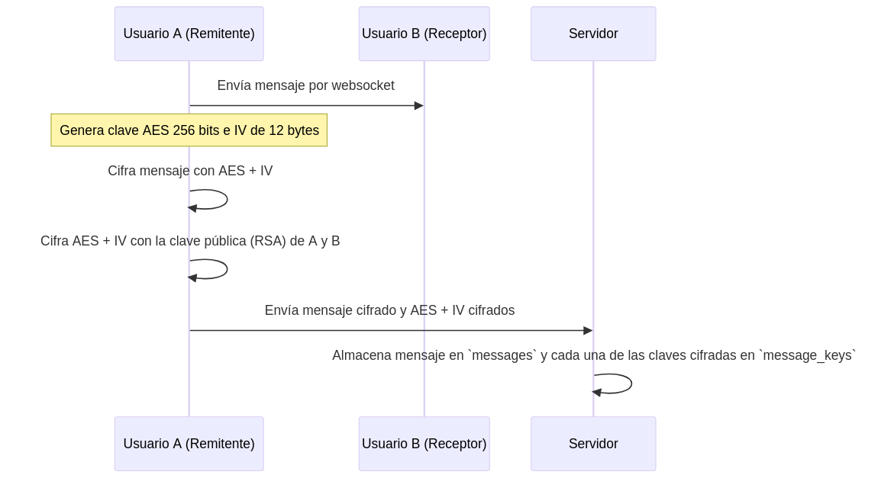
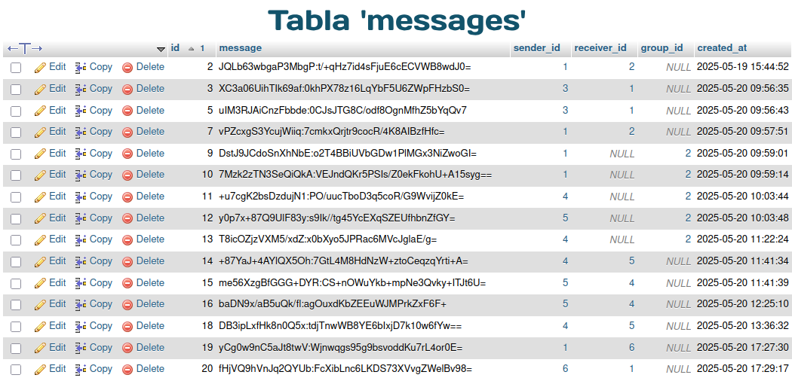
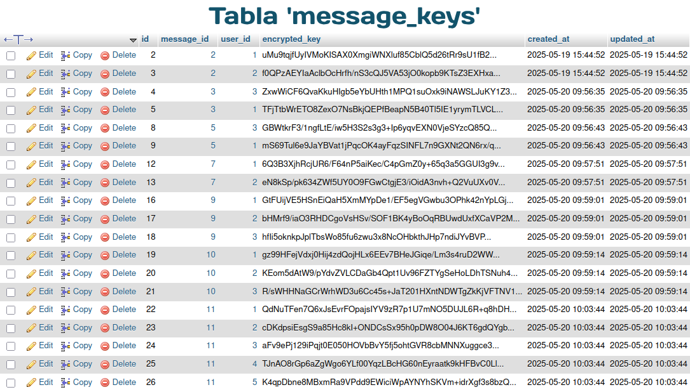

:toc: macro
:toc-title: Índice
:toclevels: 3
:sectnums: 3
:chapter-signifier!:

[[toc]]
toc::[]

<<<

== Definición del Proyecto

Este proyecto consiste en el *despliegue completamente automático de una plataforma de mensajería instantánea cifrada*. El objetivo ha sido lograr una configuración lo más genérica posible, que permita a cualquier usuario desplegar su propia instancia de la aplicación, tanto en local como en un dominio propio, con mínimas modificaciones en un único archivo `.env`.

Toda la infraestructura está desplegada mediante *Docker*, utilizando distintas redes para permitir la comunicación entre contenedores y con servicios externos que actúan como proxy hacia el exterior. El sistema también incluye volúmenes persistentes y bases de datos que garantizan la conservación de la información del usuario incluso tras reinicios o apagados.

La lógica de la aplicación está implementada con *Laravel*, un framework de PHP que ha facilitado una gestión organizada y estructurada de todo el backend. La parte visual y el sistema de cifrado se han desarrollado con *React*, una librería de JavaScript que ha permitido crear componentes reutilizables en toda la aplicación. Para los estilos se ha empleado *TailwindCSS*, un framework de utilidades que ha simplificado enormemente el diseño, permitiendo crear una interfaz completamente responsive y adaptable a cualquier dispositivo de forma ágil.

Desde el inicio del proyecto se ha priorizado la *seguridad y privacidad de los usuarios*, cifrando los mensajes directamente en el navegador para que el contenido nunca llegue en claro al servidor. Asimismo, se han estudiado los métodos de cifrado más adecuados para garantizar una comunicación segura y eficiente entre los usuarios.

image::assets/chat.png[]

== Palabras Clave

Docker, encriptación, laravel, base de datos, react, mensajería

<<<

== Desarrollo del Proyecto

=== Despliegue

==== Arquitectura general

La aplicación está completamente dockerizada, de forma que **cada servicio se ejecuta de manera independiente en su propio contenedor**. Esta arquitectura basada en contenedores permite un alto nivel de aislamiento, facilita la escalabilidad y simplifica el mantenimiento y la automatización del despliegue.

Actualmente el sistema está compuesto por **siete contenedores** con la estructura que se presenta en la imagen:

==== Servicios y contenedores

A continuación se explica el archivo docker-compose, indicando cuál es la finalidad de cada contenedor y por qué está montado de esta forma.

===== Nginx

Contenedor que actúa como un **servidor web** y **proxy inverso**. Se encarga de recibir todas las solicitudes entrantes y redirigirlas al contenedor correspondiente, según el tipo de contenido:

- Redirige las peticiones HTTP al contenedor de Laravel (`app`).
- Redirige las conexiones WebSocket al contenedor `reverb-server`.

Está conectado a la red externa `proxy-network`, lo que le permite comunicarse con el contenedor `nginx_proxy`, encargado de recibir todas las peticiones procedentes de Internet. Para más detalles sobre la configuración que permite redirigir las solicitudes, utilizar un sistema de DNS dinámico y scripts para paliar con problemas con el orden de arranque, consultar el link:https://github.com/PumukyDev/tests/blob/gh-pages/2ASIR_B_BERTOS_GOMEZ_ADRIAN_PUMUKYCHAT-Anexo1.pdf[Anexo 1].

.Fragmento docker-compose.yml
[source,yaml]
----
nginx:
  image: nginx:alpine
  container_name: nginx_chat
  restart: unless-stopped
  depends_on:
    - app
  volumes:
    - ./src:/var/www
    - ./nginx/conf.d/default.conf:/etc/nginx/conf.d/default.conf
    - ./nginx/nginx.conf:/etc/nginx/nginx.conf
  networks:
    - proxy-network
----

===== App

Contenedor principal del backend, construido con el framework de PHP **Laravel**. Gestiona las peticiones HTTP entrantes, las procesa, accede a la base de datos y coordina el funcionamiento general del sistema. Laravel proporciona una arquitectura basada en controladores, modelos, validaciones y recursos API. Permite descargar paquetes como **Laravel Breeze** que ha permitido implementar fácilmente funcionalidades de autenticación como el inicio de sesión, registro, recuperación de contraseña, etc.

.Fragmento docker-compose.yml
[source,yaml]
----
app:
  build:
    context: .
    dockerfile: ./app/Dockerfile
  container_name: app_chat
  working_dir: /var/www
  restart: unless-stopped
  depends_on:
    - database
    - node
  environment:
    DB_DATABASE: ${DB_DATABASE}
    DB_USERNAME: ${DB_USER}
    DB_PASSWORD: ${DB_PASSWORD}
    DB_HOST: database
  volumes:
    - ./src:/var/www
  networks:
    - mysql-network
----

===== Queue Worker

Contenedor que ejecuta los *trabajos en segundo plano* (jobs) definidos en Laravel. Permite descargar la carga del contenedor principal `app` procesando tareas asincrónicas como el borrado de mensajes o grupos enteros, envío de eventos o cualquier operación que pueda tardar mucho sin bloquear la respuesta al usuario.

.Fragmento docker-compose.yml
[source,yaml]
----
  queue-worker:
    build:
      context: .
      dockerfile: ./app/Dockerfile
    container_name: queue_chat
    working_dir: /var/www
    command: php artisan queue:work
    restart: unless-stopped
    depends_on:
      - app
    environment:
      DB_DATABASE: ${DB_DATABASE}
      DB_USERNAME: ${DB_USER}
      DB_PASSWORD: ${DB_PASSWORD}
      DB_HOST: database
    volumes:
      - ./src:/var/www
    networks:
      - mysql-network
----

===== Reverb Server

Contenedor que gestiona las **conexiones WebSocket** mediante **Laravel Reverb**, el sistema oficial de Laravel para la comunicación en tiempo real. A través de este servicio, los mensajes se transmiten de forma instantánea a todos los clientes conectados, sin necesidad de recargar la página. Para información sobre los WebSockets, consultar el link:https://github.com/PumukyDev/tests/blob/gh-pages/2ASIR_B_BERTOS_GOMEZ_ADRIAN_PUMUKYCHAT-Anexo2.pdf[Anexo 2].

.Fragmento docker-compose.yml
[source,yaml]
----
  reverb-server:
    build:
      context: .
      dockerfile: ./app/Dockerfile
    container_name: reverb_chat
    working_dir: /var/www
    command: php artisan reverb:start --debug
    restart: unless-stopped
    depends_on:
      - app
    environment:
      DB_DATABASE: ${DB_DATABASE}
      DB_USERNAME: ${DB_USER}
      DB_PASSWORD: ${DB_PASSWORD}
      DB_HOST: database
    volumes:
      - ./src:/var/www
    networks:
      - mysql-network
----

===== Node

Contenedor responsable de la **compilación del frontend**. Utiliza **Vite** para compilar y optimizar los archivos que después se van a servir. Esto es necesario porque el frontend está desarrollado en React y TailwindCSS, y los navegadores no pueden interpretar directamente estos lenguajes.

* **React** es una librería de JavaScript para construir interfaces de usuario mediante **componentes reutilizables**. En este proyecto se han creado **34 componentes**, que van desde los más simples (como botones o campos de texto), hasta componentes más complejos como el chat principal, la lista de usuarios y grupos, y el sistema de notificaciones.

* **TailwindCSS** es un framework de CSS que permite crear estilos de forma rápida mediante **clases utilitarias**. En este proyecto se han utilizado **más de 200 clases** para diseñar una interfaz **responsive**, adaptada a cualquier tipo de dispositivo.

Aquí hay unos ejemplos de cómo se ve la aplicación en dispositivos móviles, tanto en modo claro como en modo oscuro:

Este contenedor se ejecuta **una sola vez al iniciar el sistema**. Tras la compilación, el servicio se **apaga** y no consume más recursos. En caso de usar este sistema en un entorno de desarrollo, solo habría que cambiar el comando `npm run build` por `npm run dev`, y el contenedor recompilaría el código automáticamente tras cada cambio sin apagarse.

.Fragmento docker-compose.yml
[source,yaml]
----
  node:
    image: node:18
    container_name: node_chat
    working_dir: /app
    volumes:
      - ./src:/app
    command: sh -c "npm install && npm run build"
----

===== Database

Contenedor que ejecuta una instancia de **MariaDB**, una base de datos relacional muy similar a MySQL utilizada porque estaba optimizada para arquitecturas ARM, lo cual es especialmente importante ya que toda la infraestructura se ejecuta sobre una **Raspberry Pi 5**. En esta base de datos se almacena de forma persistente toda la información de usuarios, conversaciones, mensajes, claves cifradas y archivos adjuntos.

.Fragmento docker-compose.yml
[source,yaml]
----
  database:
    image: mariadb:latest
    container_name: database_chat
    restart: unless-stopped
    environment:
      MYSQL_DATABASE: ${DB_DATABASE}
      MYSQL_ROOT_PASSWORD: ${DB_ROOT_PASSWORD}
      MYSQL_USER: ${DB_USER}
      MYSQL_PASSWORD: ${DB_PASSWORD}
    volumes:
      - db-data:/var/lib/mysql
    networks:
      - mysql-network
----

===== phpMyAdmin

Contenedor que proporciona una **interfaz web gráfica para la administración de la base de datos**. Se utiliza exclusivamente para tareas internas de mantenimiento o inspección de datos y **no está expuesto al exterior**.

.Fragmento docker-compose.yml
[source,yaml]
----
  phpmyadmin:
    image: phpmyadmin:5.2
    container_name: phpmyadmin_chat
    restart: unless-stopped
    environment:
      PMA_HOST: ${PMA_HOST}
      PMA_USER: ${PMA_USER}
      PMA_PASSWORD: ${PMA_PASSWORD}
    ports:
      - "8080:80"
    networks:
      - mysql-network
    depends_on:
      - database
----

=== Sistema de cifrado extremo a extremo

PumukyChat aplica cifrado extremo a extremo (E2EE) en todas las conversaciones. Solo los participantes legítimos pueden leer el contenido de los mensajes. A continuación se describen las tres fases principales de este sistema: generación de claves, cifrado y descifrado de mensajes.

==== Generación de claves

Cuando un usuario se registra, genera en su navegador un par de claves RSA de 4096 bits utilizando la link:https://developer.mozilla.org/en-US/docs/Web/API/Web_Crypto_API[Web Crypto API]. El siguiente fragmento de `Register.jsx` muestra cómo se crea el par de claves y se exporta en formato PEM para su almacenamiento:

.Fragmento Register.jsx
[source,javascript]
----
const { publicKey, privateKey } = await cryptoHelpers.generateRSAKeyPair();
// Exportar claves a PEM
const publicKeyPem = await cryptoHelpers.exportPublicKey(publicKey);
const privateKeyPem = await cryptoHelpers.exportPrivateKey(privateKey);
// Guardar la clave privada en IndexedDB
await db.keys.put(privateKeyPem, 'privateKey');
// Enviar clave pública al servidor
socket.emit('register', { username, publicKey: publicKeyPem });
----

* La clave privada en una base de datos local cifrada llamada IndexedDB SecureChatKeys (almacén keys)
* La clave pública la envía al servidor para guardarla en la tabla users.

==== Cifrado de mensajes

Al enviar un mensaje, el cliente genera una clave AES de 256 bits y un IV aleatorio de 12 bytes. Luego cifra el texto del mensaje usando AES-GCM con esa clave e IV. Se puede ver esto en `MessageInput.jsx`:

.Fragmento MessageInput.jsx
[source,javascript]
----
const aesKey = await window.crypto.subtle.generateKey(
{ name: "AES-GCM", length: 256 },
true, ["encrypt", "decrypt"]
);
const iv = window.crypto.getRandomValues(new Uint8Array(12));
// Cifrar el mensaje con AES-GCM
const encryptedMessage = await cryptoHelpers.encryptWithAES(aesKey, iv, messageText);
----

A continuación se exporta la clave AES (raw), y esa clave se cifra usando RSA-OAEP con la clave pública de cada participante (remitente y receptores). Por ejemplo:

.Fragmento MessageInput.jsx
[source,javascript]
----
const rawAesKey = await window.crypto.subtle.exportKey("raw", aesKey);
const recipients = [senderPublicKeyPem, ...otherRecipientsPublicKeys];
for (const pubPem of recipients) {
const pubKey = await cryptoHelpers.importPublicKey(pubPem);
const encryptedKey = await window.crypto.subtle.encrypt(
{ name: "RSA-OAEP" },
pubKey,
rawAesKey
);
// Enviar o guardar encryptedKey para este destinatario
}
----

Finalmente, el cliente envía al servidor el mensaje cifrado (con su IV) y cada clave AES cifrada. El servidor almacena el mensaje en la tabla messages y cada clave AES cifrada en la tabla message_keys, asociando cada clave con el identificador del mensaje y del usuario destinatario.

[[message_keys]]

Como se observa en las imágenes anteriores, la tabla `message_keys` crece mucho más rápido que la tabla `messages`. Ya que hay que cifrar cada mensaje para cada usuario con acceso al mensaje.

Por ejemplo, el mensaje con `id = 2` aparece asociado a dos claves (usuarios 1 y 2), mientras que el mensaje con `id = 11`, enviado a un grupo, tiene seis claves asociadas (una por cada miembro del grupo).

==== Descifrado de mensajes

image::assets/mermaids/desencriptado.png[scaledwidth=100%,align=center]

Al recibir nuevos mensajes, el cliente primero carga su clave privada RSA de IndexedDB:

.Fragmento Home.jsx
[source,javascript]
----
const db = await openDB("SecureChatKeys", 1);
const privateKeyPem = await db.keys.get("privateKey");
const privateKey = await cryptoHelpers.importPrivateKey(privateKeyPem);
----

Luego solicita al servidor el mensaje cifrado, su IV y la clave AES cifrada correspondiente a ese usuario. Con la clave privada RSA, descifra la clave AES:

.Fragmento Home.jsx
[source,javascript]
----
const decryptedRawKey = await window.crypto.subtle.decrypt(
{ name: "RSA-OAEP" },
privateKey,
encryptedKeyForThisUser
);
// Importar clave AES descifrada
const aesKey = await window.crypto.subtle.importKey(
"raw", decryptedRawKey, { name: "AES-GCM" },
false, ["decrypt"]
);
----

Con la clave AES importada, finalmente descifra el mensaje con AES-GCM.

.Fragmento cryptoHelpers.js
[source,javascript]
----
const decryptedMessage = await cryptoHelpers.decryptWithAES(aesKey, iv, encryptedMessage);
----

El texto original descifrado se muestra en pantalla. Así, solo el destinatario legítimo (poseedor de la clave privada RSA) puede recuperar la clave AES y leer el contenido del mensaje.

Para más información sobre el sistema de encriptación usado como por ejemplo por qué se cifran dos veces los mensajes o por qué no se usan otras alternativas, consulta el link:https://github.com/PumukyDev/tests/blob/gh-pages/2ASIR_B_BERTOS_GOMEZ_ADRIAN_PUMUKYCHAT-Anexo3.pdf[Anexo 3].

=== Manejo de datos

==== Procesamiento y almacenamiento de mensajes

Cuando un usuario envía un mensaje, el `MessageController` maneja la petición validada por `StoreMessageRequest`. A partir de ahí, se ejecuta la lógica principal en varios pasos:

* Se comprueba si es un mensaje privado o de grupo. En el primer caso, debe incluirse la clave AES cifrada tanto para el emisor como para el receptor.
* Se crea el registro del mensaje en la tabla `messages`, guardando el contenido cifrado.
* Se guardan las claves AES cifradas en la tabla `message_keys` (la cual vimos xref:message_keys[anteriomente]). En mensajes privados se guardan dos (una por usuario). En grupos, se guarda una por cada miembro.
* Si hay archivos adjuntos, se almacenan en disco y se asocian al mensaje mediante `message_attachments`.
* Se actualiza el campo `last_message_id` en la conversación o grupo correspondiente.
* Se emite un evento WebSocket (`SocketMessage`) con el mensaje.
* Se carga el mensaje con sus relaciones para devolverlo en la respuesta final.

.Fragmento MessageController.php
[source,php]
----
public function store(StoreMessageRequest $request)
{
    $data = $request->validated();
    $senderId = auth()->id();
    $data['sender_id'] = $senderId;
    $receiverId = $data['receiver_id'] ?? null;
    $groupId = $data['group_id'] ?? null;
    $files = $data['attachments'] ?? [];

    // Guardar mensaje cifrado
    $message = Message::create([
        'message' => $data['message'],
        'sender_id' => $senderId,
        'receiver_id' => $receiverId,
        'group_id' => $groupId,
    ]);

    // Guardar claves cifradas
    if ($receiverId) {
        MessageKey::create([
            'message_id' => $message->id,
            'user_id' => $senderId,
            'encrypted_key' => $request->input('encrypted_key_for_sender'),
        ]);
        MessageKey::create([
            'message_id' => $message->id,
            'user_id' => $receiverId,
            'encrypted_key' => $request->input('encrypted_key_for_receiver'),
        ]);
    } elseif ($groupId) {
        $keys = $request->input('keys', []);
        foreach ($keys as $userId => $encryptedKey) {
            MessageKey::create([
                'message_id' => $message->id,
                'user_id' => $userId,
                'encrypted_key' => $encryptedKey,
            ]);
        }
    }

    // Guardar adjuntos
    $attachments = [];
    foreach ($files as $file) {
        $directory = 'attachments/' . Str::random(32);
        $attachments[] = MessageAttachment::create([
            'message_id' => $message->id,
            'name' => $file->getClientOriginalName(),
            'mime' => $file->getClientMimeType(),
            'size' => $file->getSize(),
            'path' => $file->store($directory, 'public'),
        ]);
    }
    $message->attachments = $attachments;

    // Actualizar la conversación o grupo
    if ($receiverId) {
        Conversation::updateConversationWithMessage($receiverId, $senderId, $message);
    } elseif ($groupId) {
        Group::updateGroupWithMessage($groupId, $message);
    }

    // Emitir mensaje por WebSocket
    $messageToEmit = clone $message;
    if ($request->has('message')) {
        $messageToEmit->message = $request->input('message');
    }
    SocketMessage::dispatch($messageToEmit);

    // Devolver el mensaje con relaciones
    $message = Message::with('sender', 'attachments')->find($message->id);

    return new MessageResource($message);
}
----

==== Validación de peticiones

Las peticiones HTTP que crean o actualizan recursos en la aplicación pasan por objetos de validación específicos (`FormRequest`) que se encargan de garantizar que los datos son coherentes, seguros y completos antes de ser procesados.

Esto reduce la lógica en los controladores y previene inconsistencias, como enviar mensajes vacíos, grupos sin usuarios o claves malformateadas.

Para lograr esto, se implementan muchas validaciones para los diferentes endpoints. Vamos a explicar brevemente las validaciones al enviar un mensaje o crear un grupo, pero hay muchos más para por ejemplo actualizar los datos de un grupo, del perfil, etc.

===== Validación al enviar un mensaje (`StoreMessageRequest`)

Este `FormRequest` permite enviar tanto mensajes de texto como archivos adjuntos, ya sea a un grupo o a un usuario concreto. También valida las claves cifradas asociadas a cada destinatario:

.Fragmento StoreMessageRequest.php
[source,php]
----
public function rules(): array
{
    return [
        'message' => 'nullable|string',
        'group_id' => 'required_without:receiver_id|nullable|exists:groups,id',
        'receiver_id' => 'required_without:group_id|nullable|exists:users,id',
        'attachments' => 'nullable|array|max:10',
        'attachments.*' => 'file|max:1024000',
        'keys' => 'nullable|array',
        'keys.*' => 'required|string',
    ];
}
----

* `message`: texto del mensaje (puede ser nulo si solo hay adjuntos).
* `group_id` / `receiver_id`: uno de los dos debe estar presente, nunca ambos nulos.
* `attachments`: permite hasta 10 archivos de máximo 1 GB cada uno (aunque esto está limitado por nginx a 500MB en total).
* `keys`: claves AES cifradas por usuario.

[[store_group_request]]
===== Validación al crear un grupo (`StoreGroupRequest`)

Este `FormRequest` asegura que el grupo tenga nombre válido y usuarios válidos. También establece automáticamente el `owner_id` del grupo como el usuario autenticado:

.Fragmento StoreGroupRequest.php
[source,php]
----
public function rules(): array
{
    return [
        'name' => ['required', 'string', 'max:255'],
        'description' => ['nullable', 'string'],
        'user_ids' => ['nullable', 'array'],
        'user_ids.*' => ['integer', 'exists:users,id'],
    ];
}

public function validated($key = null, $default = null)
{
    $validated = parent::validated($key, $default);
    $validated['owner_id'] = $this->user()->id;
    return $validated;
}
----

* `name`: obligatorio.
* `description`: opcional.
* `user_ids`: usuarios que formarán parte del grupo.

==== Creación y gestión de grupos

El `GroupController` se encarga de crear, actualizar y eliminar grupos de chat. Internamente, usa xref:store_group_request[peticiones validadas] y un job en segundo plano (`DeleteGroupJob`) para gestionar correctamente los recursos asociados.

===== Creación de grupos

Una vez validados los datos, el controlardor se encarga de crear el grupo en la base de datos.

.Fragmento GroupController.php
[source,php]
----
public function store(StoreGroupRequest $request)
{
    $data = $request->validated();
    $user_ids = $data['user_ids'] ?? [];

    $group = Group::create($data);
    $group->users()->attach(array_unique([$request->user()->id, ...$user_ids]));

    return redirect()->back();
}
----

* `Group::create($data)` crea el grupo con el nombre y descripción proporcionados.
* Se añaden los usuarios al grupo, incluyendo siempre al creador.

===== Eliminación de grupos

Cuando un usuario elimina un grupo, se programa un job asíncrono con un pequeño retraso de 10 segundos. Esto evita que la eliminación bloquee la respuesta HTTP y permite liberar los recursos de forma ordenada.

.Fragmento GroupController.php
[source,php]
----
public function destroy(Group $group)
{
    if ($group->owner_id !== auth()->id()) {
        abort(403);
    }

    DeleteGroupJob::dispatch($group)->delay(now()->addSeconds(10));

    return response()->json(['message' => 'Group delete was scheduled and will be deleted soon']);
}
----

* Solo el propietario del grupo puede eliminarlo.
* La tarea se pospone ligeramente con `->delay(...)` para evitar conflictos con eventos en curso.

==== Eliminación de mensajes

Cuando un usuario elimina un mensaje, no solo se borra su contenido de la base de datos, sino que también se eliminan todos los recursos asociados: claves AES cifradas, archivos adjuntos y referencias al último mensaje en conversaciones o grupos.

Este proceso se divide en dos niveles complementarios:

* **Nivel 1: Controlador (`MessageController`)**, que inicia la eliminación tras verificar permisos.
* **Nivel 2: Observador (`MessageObserver`)**, que limpia y actualiza relaciones automáticamente tras la eliminación.

===== Desde el controlador

El método `destroy()` en `MessageController` es el punto de entrada cuando un usuario quiere eliminar un mensaje. Este método:

. Verifica que el usuario autenticado sea el remitente del mensaje.
. Elimina todas las claves AES cifradas asociadas al mensaje (de la tabla `message_keys`).
. Elimina cada archivo adjunto tanto del sistema de ficheros como de la base de datos.
. Elimina el mensaje, lo cual automáticamente dispara el `observer`.

.Fragmento MessageController.php
[source,php]
----
public function destroy(Message $message)
{
    if ($message->sender_id !== auth()->id()) {
        return response()->json(['message' => 'Forbidden'], 403);
    }

    // Eliminar claves cifradas asociadas
    $message->keys()->delete();

    // Eliminar cada archivo físico y su registro
    $message->attachments()->each(function ($attachment) {
        Storage::disk('public')->delete($attachment->path);
        $attachment->delete();
    });

    // Eliminar el mensaje (esto dispara el observer)
    $message->delete();

    return response()->json(['message' => 'Message deleted successfully']);
}
----

===== Desde el observer

Una vez que se elimina un mensaje con `$message->delete()`, Laravel ejecuta automáticamente el método `deleting()` del `MessageObserver`. Este método:

* Borra el directorio completo donde estaban almacenados los archivos adjuntos.
* Vuelve a eliminar los registros de adjuntos (por si quedaron).
* Comprueba si el mensaje eliminado era el último de una conversación o grupo.
** Si lo era, busca el mensaje anterior más reciente y actualiza `last_message_id`.

Esto garantiza que las conversaciones y grupos mantengan su historial consistente incluso tras borrar mensajes.

.Fragmento MessageObserver.php
[source,php]
----
public function deleting(Message $message)
{
    // Eliminar carpetas de adjuntos
    $message->attachments->each(function ($attachment) {
        Storage::disk('public')->deleteDirectory(dirname($attachment->path));
    });

    // Eliminar registros de adjuntos (refuerzo)
    $message->attachments()->delete();

    // Si es mensaje de grupo, actualizar el last_message_id
    if ($message->group_id) {
        $group = Group::where('last_message_id', $message->id)->first();
        if ($group) {
            $prev = Message::where('group_id', $group->id)
                ->where('id', '!=', $message->id)
                ->latest()
                ->first();
            if ($prev) {
                $group->last_message_id = $prev->id;
                $group->save();
            }
        }
    }
    // Si es conversación individual, hacer lo mismo
    else {
        $conversation = Conversation::where('last_message_id', $message->id)->first();
        if ($conversation) {
            $prev = Message::where(function ($q) use ($message) {
                    $q->where('sender_id', $message->sender_id)
                      ->where('receiver_id', $message->receiver_id)
                      ->orWhere('sender_id', $message->receiver_id)
                      ->where('receiver_id', $message->sender_id);
                })
                ->where('id', '!=', $message->id)
                ->latest()
                ->first();
            if ($prev) {
                $conversation->last_message_id = $prev->id;
                $conversation->save();
            }
        }
    }
}
----

==== Actualización de conversaciones y grupos

Cuando se envía un nuevo mensaje, se actualiza el campo `last_message_id`, que permite ordenar los mensajes en la barra lateral. Esto se logra usándo métodos dentro de los modelos `Conversation` y `Group`.

===== Conversaciones individuales

El modelo `Conversation` representa una relación 1:1 entre dos usuarios. Cada vez que se envía un nuevo mensaje, se llama al método `updateConversationWithMessage`, que:

* Busca si ya existe una conversación entre los dos usuarios involucrados (en cualquier orden).
* Si existe, actualiza su campo `last_message_id`.
* Si no existe, crea una nueva conversación con ese último mensaje.

.Fragmento Conversation.php
[source,php]
----
public static function updateConversationWithMessage($userId1, $userId2, $message)
{
    $conversation = self::where(function ($query) use ($userId1, $userId2) {
        $query->where('user_id1', $userId1)
              ->where('user_id2', $userId2);
    })->orWhere(function ($query) use ($userId1, $userId2) {
        $query->where('user_id1', $userId2)
              ->where('user_id2', $userId1);
    })->first();

    if ($conversation) {
        $conversation->update([
            'last_message_id' => $message->id,
        ]);
    } else {
        self::create([
            'user_id1' => $userId1,
            'user_id2' => $userId2,
            'last_message_id' => $message->id,
        ]);
    }
}
----

===== Grupos

El modelo `Group` también actualiza su campo `last_message_id` cada vez que recibe un nuevo mensaje. Esto se realiza a través del método `updateGroupWithMessage`.

.Fragmento Group.php
[source,php]
----
public static function updateGroupWithMessage($groupId, $message)
{
    return self::updateOrCreate(
        ['id' => $groupId],
        ['last_message_id' => $message->id]
    );
}
----

==== Visualización de mensajes.

El componente `Home.jsx` es responsable de mostrar el historial de mensajes y gestionar el desencriptado local.

Cuando el usuario abre una conversación, se reciben últimos 10 mensajes desde el servidor. Antes de ser renderizados, estos mensajes se desencriptan en el navegador usando la clave privada almacenada en `IndexedDB`.

Además, si el usuario hace scroll hacia arriba, se activa un `IntersectionObserver` que llama automáticamente a `loadMoreMessages()`, el cual carga más mensajes anteriores desde el servidor y los desencripta del mismo modo.

.Fragmento Home.jsx
[source,jsx]
----
const loadMoreMessages = useCallback(() => {
    if (noMoreMessages) return;

    const firstMessage = localMessages[0];
    axios
        .get(route("message.loadOlder", firstMessage.id))
        .then(async ({ data }) => {
            if (data.data.length == 0) {
                setNoMoreMessages(true);
                return;
            }

            const scrollHeight = messagesCtrRef.current.scrollHeight;
            const scrollTop = messagesCtrRef.current.scrollTop;
            const clientHeight = messagesCtrRef.current.clientHeight;
            const tmpScrollFromBottom = scrollHeight - scrollTop - clientHeight;
            setScrollFromBottom(tmpScrollFromBottom);

            const decrypted = await decryptAllMessages(data.data);
            setLocalMessages((prev) => [...decrypted.reverse(), ...prev]);
        });
}, [localMessages, noMoreMessages]);
----

La posición de scroll se conserva tras cargar mensajes antiguos, para evitar saltos visuales en la interfaz.

Además, si el usuario recibe o manda un mensaje y se encuentra abajo, el scroll  también se moverá hacia abajo de tal forma que el mensaje se pordrá leer sin necesidad de hacer scroll manualmente.

===== Observador de intersección

Este fragmento configura el `IntersectionObserver`, que dispara la carga cuando el marcador `loadMoreIntersect` entra en el viewport:

[source,jsx]
----
useEffect(() => {
    const observer = new IntersectionObserver(
        (entries) =>
            entries.forEach((entry) => entry.isIntersecting && loadMoreMessages()),
        { rootMargin: "0px 0px 250px 0px" }
    );

    if (loadMoreIntersect.current) {
        setTimeout(() => observer.observe(loadMoreIntersect.current), 100);
    }

    return () => observer.disconnect();
}, [localMessages]);
----

<<<

== Conclusiones

Durante el desarrollo de este proyecto me propuse aplicar todos los conocimientos adquiridos a lo largo de estos dos años. Tras descartar varias ideas iniciales, pensé que el despliegue de un chat cifrado sería una opción ideal, ya que integra múltiples áreas de conocimiento: criptografía, bases de datos, desarrollo backend con PHP mediante el framework Laravel, frontend con React (JavaScript) y diseño visual utilizando TailwindCSS. Además, incluye despliegue automatizado, integración continua y una orquestación mediante scripts, con el objetivo de lograr la máxima disponibilidad del sistema.

Este proyecto me ha permitido ir más allá de los contenidos vistos en clase, profundizando en herramientas y tecnologías reales. Aunque muchas de las tecnologías empleadas se basan en lo aprendido en el ciclo, he tenido que investigar por mi cuenta para poder aplicarlas correctamente.

Los mayores retos surgieron precisamente en las áreas que no se han abordado directamente durante la formación. Uno de los principales fue la implementación de la comunicación en tiempo real mediante WebSockets. Probé muchas soluciones hasta que encontré en Laravel Reverb. Aun así, su integración con HTTPS y Nginx me supuso varios días de pruebas y resolución de conflictos relacionados con certificados y la configuración del proxy inverso.

Comencé el desarrollo del sistema durante las vacaciones de Navidad, trabajando en un prototipo de sistema de cifrado basado en RSA. Esta primera versión la permitió la implementación de la funcionalidad más importante del proyecto: la encriptación total de los mensajes, garantizando la confidencialidad incluso frente al propio servidor.

La evolución del proyecto ha sido bastante fluida, y he aprendido a desarrollar de forma iterativa, resolviendo los problemas a medida que surgían y reflexionando sobre posibles mejoras con cada avance.

Más allá del aspecto técnico, me siento muy satisfecho con el resultado funcional y el potencial real de la aplicación. La posibilidad de enviar mensajes cifrados de forma anónima, segura y desde un navegador es una característica que pocas aplicaciones ofrecen actualmente. De hecho, la mayoría de servicios de mensajería cifrada están limitados a entornos móviles o de escritorio, mientras que este proyecto propone una solución accesible desde cualquier dispositivo con conexión web.

El sistema está diseñado para ser ampliable y creo sinceramente que puede convertirse en un producto real. Las posibilidades de evolución son muchas: desde la integración de inteligencia artificial en chats, hasta la conexión con servicios de almacenamiento cifrado para sincronizar adjuntos o integrar backups seguros.

El desarrollo ha sido una experiencia increíblemente enriquecedora, aunque también exigente, y ha sido mucho más llevadero gracias al apoyo y la implicación del profesorado, a quienes quiero agradecer especialmente.

<<<

== Recursos bibliográficos y páginas web consultadas

* link:https://docs.docker.com/guides/frameworks/laravel/development-setup/[Laravel Development Setup with Docker Compose - Docker Docs] - 05/01/2025
* link:https://laravel.com/docs/12.x/authentication[Laravel Docs - “Authentication”] - 05/01/2025
* link:https://www.digitalocean.com/community/tutorials/how-to-set-up-laravel-nginx-and-mysql-with-docker-compose[How To Set Up Laravel, Nginx, and MySQL with Docker Compose] - 07/01/2025
* link:https://docs.docker.com/[Docker Docs - Official Documentation] - 07/01/2025
* link:https://laravel.com/docs/11.x/encryption[Laravel Docs - “Encryption”] - 06/01/2025
* link:https://developer.mozilla.org/en-US/docs/Web/API/Web_Crypto_API[MDN Web Docs - “Web Crypto API”] - 08/01/2025
* link:https://developer.mozilla.org/en-US/docs/Web/API/WebSockets_API[MDN Web Docs - “WebSocket API”] - 09/01/2025
* link:https://medium.com/@leoonofre.oliversoft/how-to-set-up-a-laravel-with-docker-compose-mysql-and-nginx-part-01-dd0255692b9d[How to Set Up a Laravel with Docker Compose, MySQL, and Nginx — Part 01] - 10/01/2025
* link:https://medium.com/@faidfadjri/how-to-setup-laravel-nginx-using-docker-2023-ba9de4b60d04[Medium - “Setup Laravel + Nginx using Docker”] - 12/01/2025
* link:https://medium.com/@leoonofre.oliversoft/how-to-set-up-a-laravel-with-docker-compose-mysql-and-nginx-part-02-793f8ddf5a76[How to Set Up a Laravel with Docker Compose, MySQL, and Nginx — Part 02] - 15/01/2025
* link:https://www.youtube.com/watch?v=ImtZ5yENzgE[Laravel full tutorial - Youtube video] - 15/01/2025
* link:https://docs.docker.com/guides/frameworks/laravel/production-setup/[Docker Docs - “Laravel Production Setup with Docker Compose”] - 18/01/2025
* link:https://redis.io/docs/latest/develop/interact/pubsub/[Redis Docs - Pub/Sub] - 19/01/2025
* link:https://laravel.com/docs/12.x/broadcasting[Laravel Docs - Broadcasting] - 20/01/2025
* link:https://github.com/tlaverdure/laravel-echo-server[GitHub - “laravel-echo-server” (Socket.io server for Laravel Echo)] - 21/01/2025
* link:https://medium.com/@titasgailius/running-laravel-echo-server-the-right-way-32f52bb5b1c8[Medium - “Running Laravel Echo Server the right way”] - 22/01/2025
* link:https://github.com/demarillacizere/Realtime-Chat[GitHub - “Realtime-Chat” (Laravel & Livewire)] - 25/01/2025
* link:https://github.com/boolfalse/laravel-reverb-react-chat[GitHub - “laravel-reverb-react-chat” (Laravel Reverb example)] - 26/01/2025
* link:https://github.com/raprmdn/laravel-chat-app[GitHub - “laravel-chat-app” (Laravel, InertiaJS, React, Soketi)] - 27/01/2025
* link:https://stackoverflow.com/questions/73599557/laravel-websockets-with-nginx[StackOverflow - “Laravel websockets with nginx”] - 29/01/2025
* link:https://dexie.org/[Dexie.js - IndexedDB wrapper] - 30/01/2025
* link:https://beyondco.de/docs/laravel-websockets[Beyond Code - “Laravel WebSockets”] - 02/02/2025
* link:https://developer.mozilla.org/es/docs/Web/API/Web_Crypto_API[Web Crypto API - MDN Docs] - 02/02/2025
* link:https://laravel.com/docs/12.x/sanctum[Laravel Docs - Sanctum (SPA/API Auth)] - 04/02/2025
* link:https://www.youtube.com/watch?v=WlDJlO_F5U4[Encriptación con JavaScript, AES y la Web Crypto API] - 04/02/2025
* link:https://dev.to/cardoso/end-to-end-encrypted-chat-with-the-web-crypto-api-3d02[End-to-End Encrypted Chat with the Web Crypto API] - 05/02/2025
* link:https://medium.com/devlisty/real-time-chat-application-with-laravel-11-and-socket-00f5f24542d8[Medium - “Real-time Chat App with Laravel 11 & Socket”] - 07/02/2025
* link:https://medium.com/@tony.infisical/guide-to-web-crypto-api-for-encryption-decryption-1a2c698ebc25[Guide to Web Crypto API for encryption/decryption] - 08/02/2025
* link:https://medium.com/@ibrahimoglakci/building-a-real-time-chat-application-with-laravel-and-pusher-8f3e11e5ba06[Medium - “Building a Real-Time Chat App with Laravel & Pusher”] - 09/02/2025
* link:https://www.youtube.com/watch?v=CgkZ7MvWUAA[React full course - Youtube video] - 11/02/2025
* link:https://www.twilio.com/blog/build-real-time-chat-app-laravel-vuejs-pusher[Twilio Blog – “Build Real-Time Chat App with Laravel, Vue.js & Pusher”] - 12/02/2025
* link:https://itsolutionstuff.com/post/laravel-broadcast-redis-socket-io-tutorial-example.html[ItSolutionStuff - “Laravel Broadcast with Redis & Socket.io Tutorial”] - 15/02/2025
* link:https://www.desarrollolibre.net/blog/laravel/como-crear-una-aplicacion-de-chat-en-tiempo-real-con-laravel-reverb[Desarrollolibre - “Cómo crear una app de chat con Laravel Reverb”] - 18/02/2025
* link:https://medium.com/slalom-build/managing-keys-with-web-cryptography-api-5faac6f99ca7[Managing Keys with the Web Cryptography API] - 20/02/2025
* link:https://developer.mozilla.org/en-US/docs/Web/API/IndexedDB_API[MDN Web Docs - IndexedDB API] - 20/02/2025
* link:https://www.youtube.com/watch?v=BEKiNgcBqJw[YouTube - “Real Time Chat with Laravel Reverb”] - 25/02/2025
* link:https://developer.mozilla.org/es/docs/Web/API/IndexedDB_API/Using_IndexedDB[Usando IndexedDB - MDN Docs] - 01/03/2025
* link:https://wpwebinfotech.com/blog/laravel-file-upload/[WPWebInfoTech - “Laravel File Upload: Step-by-Step”] - 03/03/2025
* link:https://dev.to/bgopikrishna/indexeddb-on-steroids-using-dexiejs-1ej4[IndexedDB on steroids using Dexie.js] - 05/03/2025
* link:https://dev.to/madsstoumann/dark-mode-in-3-lines-of-css-and-other-adventures-1ljj[Dev.to - “Dark Mode in 3 Lines of CSS”] - 07/03/2025
* link:https://gist.github.com/saulshanabrook/b74984677bccd08b028b30d9968623f5[Saving Web Crypto Keys using IndexedDB (GitHub Gist)] - 07/03/2025
* link:https://medium.com/@volodymyrzh/implementing-dark-mode-with-css-and-javascript-fd3b2105e081[Medium - “Implementing Dark Mode with CSS & JS”] - 10/03/2025
* link:https://dev.to/alexeagleson/how-to-use-indexeddb-to-store-data-for-your-web-application-in-the-browser-1o90[How to use IndexedDB to Store Local Data for your Web Application] - 10/03/2025
* link:https://www.w3schools.com/howto/howto_js_toggle_dark_mode.asp[W3Schools - “Toggle Dark/Light Mode”] - 12/03/2025
* link:https://dev.to/quicksilversel/create-a-darklight-mode-toggle-using-javascript-localstorage-55fd[Create a Dark/Light Mode Toggle using JavaScript & LocalStorage] - 15/03/2025
* link:https://developer.mozilla.org/en-US/docs/Web/API/MediaDevices/getUserMedia[MDN Web Docs - “MediaDevices.getUserMedia()”] - 15/03/2025
* link:https://developer.mozilla.org/en-US/docs/Web/CSS/@media/prefers-color-scheme[prefers-color-scheme - MDN] - 17/03/2025
* link:https://developer.mozilla.org/en-US/docs/Web/API/MediaStream_Recording_API/Using_the_MediaStream_Recording_API[MDN Web Docs - “MediaStream Recording API”] - 18/03/2025
* link:https://stackoverflow.com/questions/70117921/how-can-i-use-localstorage-in-a-dark-mode-toggle[How can I use localStorage in a dark mode toggle?] - 18/03/2025
* link:https://whitep4nth3r.com/blog/best-light-dark-mode-theme-toggle-javascript/[The best light/dark mode theme toggle in JavaScript] - 20/03/2025
* link:https://spatie.be/docs/laravel-medialibrary/v11/introduction[Spatie - “Laravel Media Library” (file uploads)] - 22/03/2025
* link:https://laravel.com/docs/12.x/dusk[Laravel Docs - “Browser Testing (Dusk)”] - 24/03/2025
* link:https://laravel.com/docs/12.x/envoy[Laravel Docs - “Envoy (deployment)”] - 02/04/2025
* link:https://developer.mozilla.org/en-US/docs/Web/API/MediaStream_Recording_API/Using_the_MediaStream_Recording_API[Using the MediaStream Recording API - MDN] - 02/04/2025
* link:https://www.twilio.com/en-us/blog/mediastream-recording-api[An introduction to the MediaRecorder API] - 04/04/2025
* link:https://dev.to/ethand91/mediarecorder-api-tutorial-54n8[MediaRecorder API Tutorial] - 06/04/2025
* link:https://www.youtube.com/watch?v=6TuEXV3VWOg[Grabar audio del micrófono con JavaScript y PHP] - 08/04/2025
* link:https://laravel.com/docs/11.x/broadcasting[Broadcasting - Laravel 11.x Docs] - 12/04/2025
* link:https://beyondco.de/docs/laravel-websockets/getting-started/introduction[Laravel WebSockets - BeyondCode Docs] - 14/04/2025
* link:https://laravel.com/docs/12.x/deployment[Laravel Docs - “Deployment” (general)] - 17/04/2025
* link:https://www.honeybadger.io/blog/a-guide-to-using-websockets-in-laravel/[A guide to using WebSockets in Laravel] - 18/04/2025
* link:https://www.freecodecamp.org/news/laravel-reverb-realtime-chat-app/[How to Build a Real-Time Chat App with Laravel Reverb] - 20/04/2025
* link:https://github.com/laravel/echo[GitHub - laravel/echo: Laravel Echo library for beautiful Reverb, Pusher, and Ably integration.] - 22/04/2025
* link:https://57blocks.io/blog/frontend-performance-optimization[Optimización de rendimiento Front-End (57Blocks)] - 26/04/2025
* link:https://www.arsys.es/blog/web-performance-optimization[Optimización del rendimiento web: buenas prácticas (Arsys)] - 26/04/2025
* link:https://es.stackoverflow.com/questions/489548/laravel-websockets-en-channel-private[StackOverflow ES - “Laravel WebSockets en canal privado”] - 01/05/2025
* link:https://stackoverflow.com/questions/74086293/laravel-event-not-being-broadcasted-web-laravel-websockets-server[Laravel event not being broadcasted with laravel-websockets server] - 03/05/2025
* link:https://reverb.laravel.com/[Laravel Reverb (first-party WebSocket server)] - 05/05/2025
* link:https://stackoverflow.com/questions/76457729/decrypt-cryptojs-using-laravel-with-dynamic-key[StackOverflow - “Decrypt CryptoJS using Laravel”] - 10/05/2025
* link:https://stackoverflow.com/questions/47152307/how-to-add-real-time-chat-with-notifications-in-laravel-project[StackOverflow - “Real-time chat with notifications (Laravel)”] - 12/05/2025
* link:https://www.aquasec.com/cloud-native-academy/docker-container/microservices-and-containerization/[Arquitectura de microservicios y contenedores (AquaSec)] - 14/05/2025
* link:https://medium.com/be-tech-with-santander/uso-de-docker-overlay-networks-gu%C3%ADa-de-configuraci%C3%B3n-f784c309fe7b[Redes superpuestas (Overlay) en Docker: guía de configuración] - 15/05/2025
* link:https://www.cloudthat.com/resources/blog/docker-networking-exploring-bridge-host-and-overlay-modes[Explorando redes Docker: modos Bridge, Host y Overlay] - 15/05/2025
* link:https://www.programador-web.com/2024/10/21/las-ultimas-buenas-practicas-para-programar-en-react-en-2024/[Buenas prácticas en React para 2024 (Programador Web)] - 16/05/2025
* link:https://dev.to/dennysjmarquez/react-la-guia-maxima-de-buenas-practicas-jamas-concebida-principios-solid-el-acronimo-stupid-clean-code-y-code-smell-53l7[Guía de buenas prácticas en React (principios SOLID y Clean Code)] - 16/05/2025
* link:https://www.invicti.com/blog/web-security/websocket-security-best-practices/[Seguridad en WebSockets: riesgos y buenas prácticas (Invicti)] - 18/05/2025
* link:https://dev.to/ably/websocket-security-9-common-vulnerabilities-prevention-methods-4kil[Seguridad en WebSockets: 9 vulnerabilidades comunes y cómo prevenirlas] - 18/05/2025
* link:https://devcenter.heroku.com/articles/websocket-security[Seguridad en WebSockets (Heroku Dev Center)] - 19/05/2025
* link:https://www.hostinger.com/es/tutoriales/como-configurar-proxy-inverso-nginx[Proxy inverso NGINX: configuración (HTTPS, SSL)] - 20/05/2025
* link:https://docs.docker.com/get-started/docker-concepts/running-containers/publishing-ports/[Exposición de puertos en Docker (Docker Docs)] - 20/05/2025

<<<

== Anexos

* link:https://github.com/PumukyDev/tests/blob/gh-pages/2ASIR_B_BERTOS_GOMEZ_ADRIAN_PUMUKYCHAT-Anexo1.pdf[Anexo 1].
* link:https://github.com/PumukyDev/tests/blob/gh-pages/2ASIR_B_BERTOS_GOMEZ_ADRIAN_PUMUKYCHAT-Anexo2.pdf[Anexo 2].
* link:https://github.com/PumukyDev/tests/blob/gh-pages/2ASIR_B_BERTOS_GOMEZ_ADRIAN_PUMUKYCHAT-Anexo3.pdf[Anexo 3].

<<<

