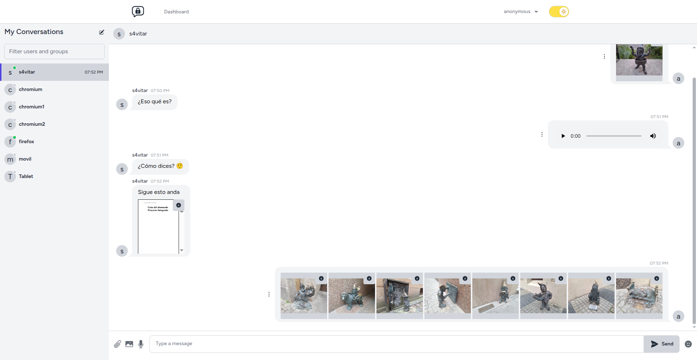
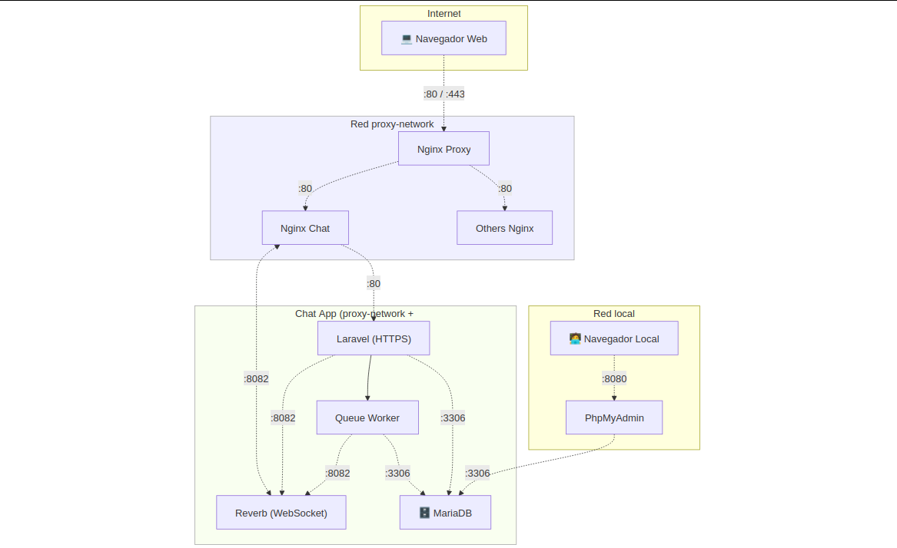
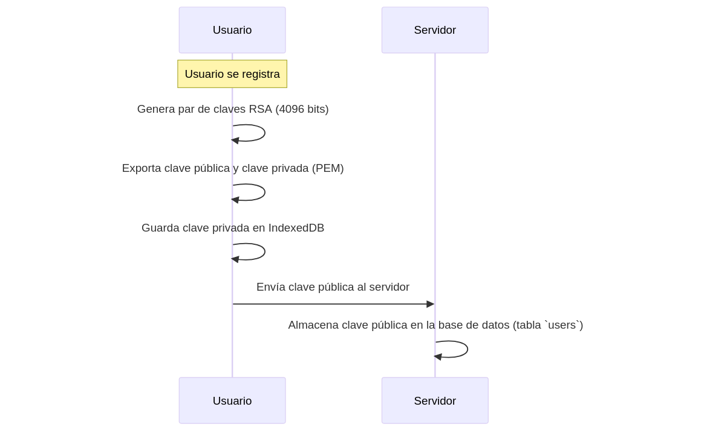
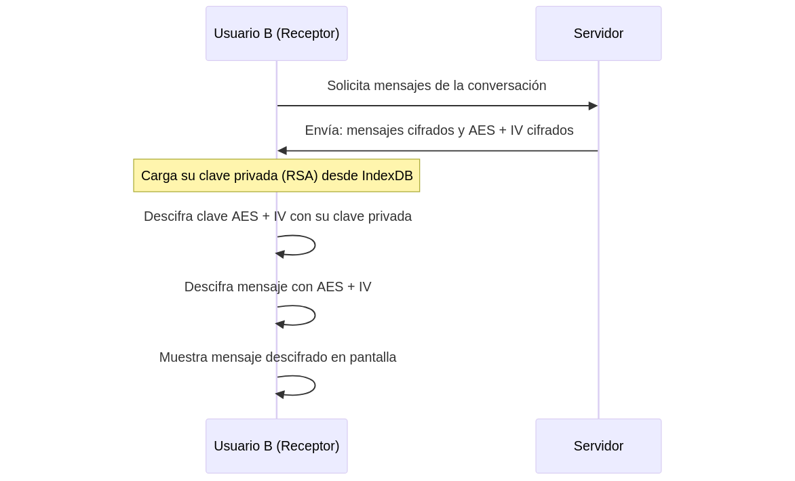

:toc: macro
:toc-title: Índice
:toclevels: 4
:sectnums:
:chapter-signifier!:

[[toc]]
toc::[]

<<<

== Definición del Proyecto

Este proyecto consiste en el *despliegue completamente automático de una plataforma de mensajería instantánea cifrada*. El objetivo ha sido lograr una configuración lo más genérica posible, que permita a cualquier usuario desplegar su propia instancia de la aplicación, tanto en local como en un dominio propio, con mínimas modificaciones en un único archivo `.env`.

Toda la infraestructura está desplegada mediante *Docker*, utilizando distintas redes para permitir la comunicación entre contenedores y con servicios externos que actúan como proxy hacia el exterior. El sistema también incluye volúmenes persistentes y bases de datos que garantizan la conservación de la información del usuario incluso tras reinicios o apagados.

La lógica de la aplicación está implementada con *Laravel*, un framework de PHP que ha facilitado una gestión organizada y estructurada de todo el backend. La parte visual y el sistema de cifrado se han desarrollado con *React*, una librería de JavaScript que ha permitido crear componentes reutilizables en toda la aplicación. Para los estilos se ha empleado *TailwindCSS*, un framework de utilidades que ha simplificado enormemente el diseño, permitiendo crear una interfaz completamente responsive y adaptable a cualquier dispositivo de forma ágil.

Desde el inicio del proyecto se ha priorizado la *seguridad y privacidad de los usuarios*, cifrando los mensajes directamente en el navegador para que el contenido nunca llegue en claro al servidor. Asimismo, se han estudiado los métodos de cifrado más adecuados para garantizar una comunicación segura y eficiente entre los usuarios.

== Palabras Clave

Docker, encriptación, laravel, base de datos, react, mensajería

<<<

== Desarrollo del Proyecto

=== Despliegue

La aplicación está completamente dockerizada, de forma que **cada servicio se ejecuta de manera independiente en su propio contenedor**. Esta arquitectura basada en contenedores permite un alto nivel de aislamiento, facilita la escalabilidad y simplifica el mantenimiento y la automatización del despliegue.

Actualmente el sistema está compuesto por **siete contenedores** que se describen a continuación:

[source,yaml]
----
  nginx:
    image: nginx:alpine
    container_name: nginx_chat
    restart: unless-stopped
    depends_on:
      - app
    volumes:
      - ./src:/var/www
      - ./nginx/conf.d/default.conf:/etc/nginx/conf.d/default.conf
      - ./nginx/nginx.conf:/etc/nginx/nginx.conf
    networks:
      - mysql-network
      - proxy-network
----

* *nginx*: contenedor que actúa como **servidor web y proxy inverso**. Recibe todas las solicitudes HTTPS y las redirige al contenedor correspondiente según el tipo de contenido solicitado: al contenedor `app` para peticiones HTTP tradicionales, y a `reverb-server` para las conexiones WebSocket en la ruta `/app`. También sirve los archivos estáticos generados por Vite.

[source,yaml]
----
  app:
    build:
      context: .
      dockerfile: ./app/Dockerfile
    container_name: app_chat
    working_dir: /var/www
    restart: unless-stopped
    depends_on:
      - database
      - node
    environment:
      DB_DATABASE: ${DB_DATABASE}
      DB_USERNAME: ${DB_USER}
      DB_PASSWORD: ${DB_PASSWORD}
      DB_HOST: database
    volumes:
      - ./src:/var/www
    networks:
      - mysql-network
----

* *app*: contenedor principal del backend, basado en el framework PHP **Laravel**. Este servicio responde a todas las peticiones HTTP entrantes, las procesa, accede a la base de datos y orquesta las demás funcionalidades del sistema. Laravel ofrece una arquitectura muy clara basada en controladores, modelos, peticiones validadoras y recursos API. Ofrece paquetes como **Laravel Breeze** por ejemplo, que ha servido para hacer un sistema de autenticación (login, registro, restablecimiento de contraseña, verificación de email, etc.) de forma sencilla.

[source,yaml]
----
  queue-worker:
    build:
      context: .
      dockerfile: ./app/Dockerfile
    container_name: queue_chat
    working_dir: /var/www
    command: php artisan queue:work
    restart: unless-stopped
    depends_on:
      - app
    environment:
      DB_DATABASE: ${DB_DATABASE}
      DB_USERNAME: ${DB_USER}
      DB_PASSWORD: ${DB_PASSWORD}
      DB_HOST: database
    volumes:
      - ./src:/var/www
    networks:
      - mysql-network
----

* *queue-worker*: ejecuta los *trabajos en segundo plano* (jobs) definidos en Laravel. Permite descargar la carga del contenedor principal `app` procesando tareas asincrónicas como el borrado de mensajes o grupos enteros, envío de eventos o cualquier operación que pueda tardar mucho sin bloquear la respuesta al usuario.

[source,yaml]
----
  reverb-server:
    build:
      context: .
      dockerfile: ./app/Dockerfile
    container_name: reverb_chat
    working_dir: /var/www
    command: php artisan reverb:start --debug
    restart: unless-stopped
    depends_on:
      - app
    environment:
      DB_DATABASE: ${DB_DATABASE}
      DB_USERNAME: ${DB_USER}
      DB_PASSWORD: ${DB_PASSWORD}
      DB_HOST: database
    volumes:
      - ./src:/var/www
    networks:
      - mysql-network
----

* *reverb-server*: gestiona las **conexiones WebSocket** usando **Laravel Reverb**, el sistema oficial de Laravel para comunicación en tiempo real. A través de este contenedor, los mensajes llegan de forma instantánea a todos los clientes conectados, sin necesidad de recargar la página.

[source,yaml]
----
  node:
    image: node:18
    container_name: node_chat
    working_dir: /app
    volumes:
      - ./src:/app
    command: sh -c "npm install && npm run build"
----

* *node*: contenedor responsable de la compilación del frontend. Utiliza **Vite** compilar y optimizar los archivos que después se van a servir. El frontend está desarrollado en **React**, con estilos gestionados mediante **TailwindCSS**.

[source,yaml]
----
  database:
    image: mariadb:latest
    container_name: database_chat
    restart: unless-stopped
    environment:
      MYSQL_DATABASE: ${DB_DATABASE}
      MYSQL_ROOT_PASSWORD: ${DB_ROOT_PASSWORD}
      MYSQL_USER: ${DB_USER}
      MYSQL_PASSWORD: ${DB_PASSWORD}
    volumes:
      - db-data:/var/lib/mysql
    networks:
      - mysql-network
----

* *database*: contenedor que ejecuta una instancia de **MariaDB**, una base de datos relacional muy similar a MySQL. En este proyecto se ha elegido una versión optimizada para arquitecturas ARM, lo cual es especialmente importante ya que toda la infraestructura se ejecuta sobre una **Raspberry Pi 5**. En esta base de datos se almacena de forma persistente toda la información de usuarios, conversaciones, mensajes, claves cifradas y archivos adjuntos.

[source,yaml]
----
  phpmyadmin:
    image: phpmyadmin:5.2
    container_name: phpmyadmin_chat
    restart: unless-stopped
    environment:
      PMA_HOST: ${PMA_HOST}
      PMA_USER: ${PMA_USER}
      PMA_PASSWORD: ${PMA_PASSWORD}
    ports:
      - "8080:80"
    networks:
      - mysql-network
    depends_on:
      - database
----

* *phpmyadmin*: proporciona una **interfaz web gráfica para la administración de la base de datos**. Se utiliza exclusivamente para tareas internas de mantenimiento o inspección de datos, y **no está expuesto al exterior**, lo cual aumenta significativamente la seguridad del sistema.

[source,yaml]
----
volumes:
  db-data:

networks:
  mysql-network:
    driver: bridge
  proxy-network:
    external: true
----

=== Sistema de cifrado extremo a extremo

Todos los mensajes están cifrados de extremo a extremo (E2EE). Esto garantiza que únicamente los participantes de la conversación puedan leer el contenido. El servidor actúa únicamente como intermediario de datos cifrados, sin acceso al contenido real.

El sistema sigue un enfoque híbrido: usa cifrado simétrico (AES-GCM) para los mensajes y cifrado asimétrico (RSA-OAEP) para proteger la clave AES.

==== Creación de claves RSA

Durante el registro del usuario se generan un par de claves RSA de 4096 bits:

[source,js]
----
const keyPair = await window.crypto.subtle.generateKey({
    name: 'RSA-OAEP',
    modulusLength: 4096,
    publicExponent: new Uint8Array([1, 0, 1]),
    hash: 'SHA-256',
}, true, ['encrypt', 'decrypt']);
----

La clave pública se exporta y se envía al servidor:

[source,js]
----
const exportedPublicKey = await crypto.subtle.exportKey('spki', keyPair.publicKey);
const publicKeyPem = convertBinaryToPem(exportedPublicKey, 'PUBLIC KEY');
----

La clave privada se exporta y se almacena cifrada localmente en IndexedDB:

[source,js]
----
const exportedPrivateKey = await crypto.subtle.exportKey('pkcs8', keyPair.privateKey);
const privateKeyPem = convertBinaryToPem(exportedPrivateKey, 'PRIVATE KEY');

await storePrivateKeyInIndexedDB(privateKeyPem);
----

Este almacenamiento local se realiza en la base de datos `SecureChatKeys`, usando el almacén `keys`:

[source,js]
----
const request = indexedDB.open('SecureChatKeys', 1);
...
store.put({ id: 'private_key', pem: privateKeyPem });
----

==== Cifrado de mensajes

Cada mensaje se cifra con una nueva clave AES de 256 bits generada en el cliente:

[source,js]
----
const aesKey = await crypto.subtle.generateKey(
  { name: "AES-GCM", length: 256 },
  true,
  ["encrypt", "decrypt"]
);
----

Se genera un IV aleatorio (12 bytes), y se cifra el texto con AES-GCM:

[source,js]
----
const iv = crypto.getRandomValues(new Uint8Array(12));
const ciphertext = await crypto.subtle.encrypt(
  { name: 'AES-GCM', iv },
  aesKey,
  new TextEncoder().encode(plaintext)
);
----

La clave AES se exporta como `raw` y se cifra con la clave pública de cada destinatario (incluido el remitente):

[source,js]
----
const rawKey = await crypto.subtle.exportKey('raw', aesKey);
const encryptedKey = await crypto.subtle.encrypt({ name: 'RSA-OAEP' }, publicKey, rawKey);
----

image::mermaids/encriptado.png[Proceso de cifrado y envío de claves cifradas al servidor]

El servidor almacena:
- El mensaje cifrado (`iv:ciphertext` en base64).
- Las claves cifradas asociadas a cada usuario (`message_keys`).

==== Descrifrado de mensajes

Cuando un usuario recibe un mensaje, su cliente:

. Carga su clave privada desde IndexedDB:

[source,js]
----
const privateKey = await loadPrivateKey();
----

. Descifra su clave AES:

[source,js]
----
const encryptedBuffer = base64ToUint8Array(encryptedBase64);
const aesKeyBuffer = await crypto.subtle.decrypt(
  { name: 'RSA-OAEP' },
  privateKey,
  encryptedBuffer
);
const aesKey = await crypto.subtle.importKey(
  'raw',
  aesKeyBuffer,
  { name: 'AES-GCM' },
  false,
  ['decrypt']
);
----

Y finalmente descifra el mensaje:

[source,js]
----
const decryptedBuffer = await crypto.subtle.decrypt(
  { name: 'AES-GCM', iv },
  aesKey,
  ciphertext
);
const plaintext = new TextDecoder().decode(decryptedBuffer);
----

Este proceso se aplica tanto en el componente de la conversación principal como en la lista lateral. Por ejemplo, en `ConversationItem.jsx` se desencripta la vista previa así:

[source,js]
----
const aesKey = await decryptAESKeyWithPrivateKey(last_message_encrypted_key, privateKey);
const plaintext = await decryptMessageAES(last_message, aesKey);
setPreview(plaintext);
----

=== Almacenamiento y validación de datos

==== Estructura de la base de datos

La base de datos está compuesta por múltiples tablas que gestionan usuarios, grupos, conversaciones, mensajes, claves cifradas y archivos adjuntos. A continuación se resumen las más relevantes:

[cols="1,3", options="header"]
|===
|Tabla |Descripción

|`users` |Usuarios registrados. Guarda nombre, correo, clave pública, avatar, si es administrador, y estado de bloqueo.
|`groups` |Grupos creados por usuarios. Cada grupo tiene un `owner_id`.
|`group_users` |Relación muchos a muchos entre usuarios y grupos.
|`conversations` |Chats privados entre dos usuarios. Se guarda también el ID del último mensaje.
|`messages` |Mensajes enviados en chats o grupos. Incluyen remitente, receptor o grupo, y texto cifrado.
|`message_keys` |Claves AES cifradas por usuario, asociadas a cada mensaje.
|`message_attachments` |Archivos adjuntos vinculados a mensajes: nombre, ruta, tipo MIME y tamaño.
|`sessions`, `cache`, `cache_locks` |Tablas internas de Laravel para gestión de sesiones y caché.
|===

==== Validación de peticiones

Laravel valida automáticamente las peticiones antes de almacenar cualquier dato en la base de datos, utilizando clases `FormRequest`. Esto protege contra errores y ataques comunes.

Por ejemplo, al enviar un mensaje:

[source,php]
----
public function rules(): array
{
    return [
        'message' => 'nullable|string',
        'group_id' => 'required_without:receiver_id|nullable|exists:groups,id',
        'receiver_id' => 'required_without:group_id|nullable|exists:users,id',
        'attachments' => 'nullable|array|max:10',
        'attachments.*' => 'file|max:1024000',
        'keys' => 'nullable|array',
        'keys.*' => 'required|string',
    ];
}
----

==== Proceso de almacenamiento de mensajes

. El frontend envía los datos mediante POST tras cifrar el mensaje y la clave AES.
. Laravel valida la estructura de la petición.
. Se guarda el mensaje en la tabla `messages`.
. Se asocian los archivos a través de `message_attachments` (si los hay).
. Para cada destinatario, se crea una entrada en la tabla `message_keys`.

[source,php]
----
MessageKey::create([
    'message_id' => $message->id,
    'user_id' => $recipientId,
    'encrypted_key' => $encryptedKey,
]);
----

==== Asociación con conversaciones y grupos

Laravel actualiza automáticamente la conversación o grupo con el último mensaje:

[source,php]
----
Conversation::updateConversationWithMessage($user1_id, $user2_id, $message);
Group::updateGroupWithMessage($group_id, $message);
----

=== Recuperación y visualización de datos

==== Usuarios y conversaciones

Para mostrar los usuarios y grupos en la barra lateral izquierda:

* Se obtiene la lista de usuarios (excepto el actual).
* Se excluyen los bloqueados si el usuario actual es administrador.
* Se unen las conversaciones, mensajes y claves para mostrar el último mensaje.
* Se incluyen los grupos a los que pertenece el usuario.

[source,php]
----
User::select(...)
    ->leftJoin('conversations', ...)
    ->leftJoin('messages', ...)
    ->leftJoin('message_keys', ...)
    ->orderBy('messages.created_at', 'desc')
    ->orderBy('users.name');
----

==== Formato de los datos enviados al frontend

Al recuperar los mensajes, se usa un recurso `MessageResource` que incluye:

* El contenido cifrado del mensaje.
* El remitente (`sender_id`) y su información.
* La clave AES cifrada solo para el usuario autenticado.
* Los archivos adjuntos.

[source,php]
----
return [
    'message' => $this->message,
    'sender_id' => $this->sender_id,
    'attachments' => MessageAttachmentResource::collection($this->attachments),
    'encrypted_key' => optional($messageKey)->encrypted_key,
];
----

==== Conversaciones privadas y grupales

Laravel ofrece métodos como:

* `User::getUsersExceptUser($user)` para chats 1-1.
* `Group::getGroupsForUser($user)` para mostrar todos los grupos del usuario actual.

Ambos devuelven los datos estructurados como conversaciones, incluyendo el último mensaje y la clave cifrada.

==== Ordenación y filtrado

Los datos se ordenan por:

* `messages.created_at` para mostrar lo más reciente primero.
* `users.name` o `groups.name` como orden secundario.

Se filtran por:

* `blocked_at` si el usuario es admin.
* `message_keys.user_id = Auth::id()` para asegurar que cada usuario solo vea su clave AES cifrada.

<<<

== Conclusiones

<<<

== Recursos bibliográficos y páginas web consultadas

* link:https://docs.docker.com/guides/frameworks/laravel/development-setup/[Laravel Development Setup with Docker Compose – Docker Docs] - 05/01/2025
* link:https://laravel.com/docs/12.x/authentication[Laravel Docs – “Authentication”] - 05/01/2025
* link:https://www.digitalocean.com/community/tutorials/how-to-set-up-laravel-nginx-and-mysql-with-docker-compose[How To Set Up Laravel, Nginx, and MySQL with Docker Compose] - 07/01/2025
* link:https://docs.docker.com/[Docker Docs – Official Documentation] - 07/01/2025
* link:https://laravel.com/docs/11.x/encryption[Laravel Docs – “Encryption”] - 06/01/2025
* link:https://developer.mozilla.org/en-US/docs/Web/API/Web_Crypto_API[MDN Web Docs – “Web Crypto API”] - 08/01/2025
* link:https://developer.mozilla.org/en-US/docs/Web/API/WebSockets_API[MDN Web Docs – “WebSocket API”] - 09/01/2025
* link:https://medium.com/@leoonofre.oliversoft/how-to-set-up-a-laravel-with-docker-compose-mysql-and-nginx-part-01-dd0255692b9d[How to Set Up a Laravel with Docker Compose, MySQL, and Nginx — Part 01] - 10/01/2025
* link:https://medium.com/@faidfadjri/how-to-setup-laravel-nginx-using-docker-2023-ba9de4b60d04[Medium – “Setup Laravel + Nginx using Docker”] - 12/01/2025
* link:https://medium.com/@leoonofre.oliversoft/how-to-set-up-a-laravel-with-docker-compose-mysql-and-nginx-part-02-793f8ddf5a76[How to Set Up a Laravel with Docker Compose, MySQL, and Nginx — Part 02] - 15/01/2025
* link:https://laracasts.com/series/30-days-to-learn-laravel-11[Laracasts – “30 Days to Learn Laravel” course] - 15/01/2025
* link:https://laracasts.com/series/the-docker-tutorial[The Docker Tutorial (Laracasts series)] - 18/01/2025
* link:https://docs.docker.com/guides/frameworks/laravel/production-setup/[Docker Docs – “Laravel Production Setup with Docker Compose”] - 18/01/2025
* link:https://redis.io/docs/latest/develop/interact/pubsub/[Redis Docs – Pub/Sub] - 19/01/2025
* link:https://laravel.com/docs/12.x/broadcasting[Laravel Docs – Broadcasting] - 20/01/2025
* link:https://github.com/tlaverdure/laravel-echo-server[GitHub – “laravel-echo-server” (Socket.io server for Laravel Echo)] - 21/01/2025
* link:https://medium.com/@titasgailius/running-laravel-echo-server-the-right-way-32f52bb5b1c8[Medium – “Running Laravel Echo Server the right way”] - 22/01/2025
* link:https://github.com/demarillacizere/Realtime-Chat[GitHub – “Realtime-Chat” (Laravel & Livewire)] - 25/01/2025
* link:https://github.com/boolfalse/laravel-reverb-react-chat[GitHub – “laravel-reverb-react-chat” (Laravel Reverb example)] - 26/01/2025
* link:https://github.com/raprmdn/laravel-chat-app[GitHub – “laravel-chat-app” (Laravel, InertiaJS, React, Soketi)] - 27/01/2025
* link:https://stackoverflow.com/questions/73599557/laravel-websockets-with-nginx[StackOverflow – “Laravel websockets with nginx”] - 29/01/2025
* link:https://dexie.org/[Dexie.js – IndexedDB wrapper] - 30/01/2025
* link:https://beyondco.de/docs/laravel-websockets[Beyond Code – “Laravel WebSockets”] - 02/02/2025
* link:https://developer.mozilla.org/es/docs/Web/API/Web_Crypto_API[Web Crypto API – MDN Docs] - 02/02/2025
* link:https://laravel.com/docs/12.x/sanctum[Laravel Docs – Sanctum (SPA/API Auth)] - 04/02/2025
* link:https://www.youtube.com/watch?v=WlDJlO_F5U4[Encriptación con JavaScript, AES y la Web Crypto API] - 04/02/2025
* link:https://dev.to/cardoso/end-to-end-encrypted-chat-with-the-web-crypto-api-3d02[End-to-End Encrypted Chat with the Web Crypto API] - 05/02/2025
* link:https://github.com/GetStream/encrypted-web-chat[GitHub – GetStream/encrypted-web-chat: A web chat application end-to-end encrypted with the Web Crypto API] - 06/02/2025
* link:https://medium.com/devlisty/real-time-chat-application-with-laravel-11-and-socket-00f5f24542d8[Medium – “Real-time Chat App with Laravel 11 & Socket”] - 07/02/2025
* link:https://medium.com/@tony.infisical/guide-to-web-crypto-api-for-encryption-decryption-1a2c698ebc25[Guide to Web Crypto API for encryption/decryption] - 08/02/2025
* link:https://medium.com/@ibrahimoglakci/building-a-real-time-chat-application-with-laravel-and-pusher-8f3e11e5ba06[Medium – “Building a Real-Time Chat App with Laravel & Pusher”] - 09/02/2025
* link:https://parzibyte.me/blog/2020/06/02/encriptacion-javascript-web-crypto-api/[Encriptación con JavaScript del lado del cliente usando la Web Crypto API] - 11/02/2025
* link:https://www.twilio.com/blog/build-real-time-chat-app-laravel-vuejs-pusher[Twilio Blog – “Build Real-Time Chat App with Laravel, Vue.js & Pusher”] - 12/02/2025
* link:https://stackoverflow.com/questions/75877831/php-openssl-encrypt-and-javascript-crypto-subtle-encrypt-have-different-output[PHP openssl_encrypt and Javascript crypto.subtle.encrypt have different output (AES-256-GCM)] - 12/02/2025
* link:https://itsolutionstuff.com/post/laravel-broadcast-redis-socket-io-tutorial-example.html[ItSolutionStuff – “Laravel Broadcast with Redis & Socket.io Tutorial”] - 15/02/2025
* link:https://www.desarrollolibre.net/blog/laravel/como-crear-una-aplicacion-de-chat-en-tiempo-real-con-laravel-reverb[Desarrollolibre – “Cómo crear una app de chat con Laravel Reverb”] - 18/02/2025
* link:https://medium.com/slalom-build/managing-keys-with-web-cryptography-api-5faac6f99ca7[Managing Keys with the Web Cryptography API] - 20/02/2025
* link:https://developer.mozilla.org/en-US/docs/Web/API/IndexedDB_API[MDN Web Docs – IndexedDB API] - 20/02/2025
* link:https://laracasts.com/discuss/channels/laravel/chat-system-laravel-redis-and-socket-io[Laracasts – “Chat System (Laravel, Redis, Socket.io)” discussion] - 22/02/2025
* link:https://www.youtube.com/watch?v=BEKiNgcBqJw[YouTube – “Real Time Chat with Laravel Reverb”] - 25/02/2025
* link:https://developer.mozilla.org/es/docs/Web/API/IndexedDB_API/Using_IndexedDB[Usando IndexedDB – MDN Docs] - 01/03/2025
* link:https://wpwebinfotech.com/blog/laravel-file-upload/[WPWebInfoTech – “Laravel File Upload: Step-by-Step”] - 03/03/2025
* link:https://stackoverflow.com/questions/52276862/web-crypto-api-is-a-non-exactrable-cryptokey-in-indexeddb-safe-enough-against[Web Crypto API – Is a non-extractable CryptoKey in IndexedDB safe enough against being passed from one device to the next?] - 03/03/2025
* link:https://dev.to/bgopikrishna/indexeddb-on-steroids-using-dexiejs-1ej4[IndexedDB on steroids using Dexie.js] - 05/03/2025
* link:https://dev.to/madsstoumann/dark-mode-in-3-lines-of-css-and-other-adventures-1ljj[Dev.to – “Dark Mode in 3 Lines of CSS”] - 07/03/2025
* link:https://gist.github.com/saulshanabrook/b74984677bccd08b028b30d9968623f5[Saving Web Crypto Keys using IndexedDB (GitHub Gist)] - 07/03/2025
* link:https://medium.com/@volodymyrzh/implementing-dark-mode-with-css-and-javascript-fd3b2105e081[Medium – “Implementing Dark Mode with CSS & JS”] - 10/03/2025
* link:https://dev.to/alexeagleson/how-to-use-indexeddb-to-store-data-for-your-web-application-in-the-browser-1o90[How to use IndexedDB to Store Local Data for your Web Application] - 10/03/2025
* link:https://www.w3schools.com/howto/howto_js_toggle_dark_mode.asp[W3Schools – “Toggle Dark/Light Mode”] - 12/03/2025
* link:https://dev.to/quicksilversel/create-a-darklight-mode-toggle-using-javascript-localstorage-55fd[Create a Dark/Light Mode Toggle using JavaScript & LocalStorage] - 15/03/2025
* link:https://developer.mozilla.org/en-US/docs/Web/API/MediaDevices/getUserMedia[MDN Web Docs – “MediaDevices.getUserMedia()”] - 15/03/2025
* link:https://developer.mozilla.org/en-US/docs/Web/CSS/@media/prefers-color-scheme[prefers-color-scheme – MDN] - 17/03/2025
* link:https://developer.mozilla.org/en-US/docs/Web/API/MediaStream_Recording_API/Using_the_MediaStream_Recording_API[MDN Web Docs – “MediaStream Recording API”] - 18/03/2025
* link:https://stackoverflow.com/questions/70117921/how-can-i-use-localstorage-in-a-dark-mode-toggle[How can I use localStorage in a dark mode toggle?] - 18/03/2025
* link:https://whitep4nth3r.com/blog/best-light-dark-mode-theme-toggle-javascript/[The best light/dark mode theme toggle in JavaScript] - 20/03/2025
* link:https://www.youtube.com/watch?v=YuzTyqLnyNY[YouTube – “Laravel Vue Chat with Pusher: Attachments & Emoticons”] - 20/03/2025
* link:https://spatie.be/docs/laravel-medialibrary/v11/introduction[Spatie – “Laravel Media Library” (file uploads)] - 22/03/2025
* link:https://laravel.com/docs/12.x/dusk[Laravel Docs – “Browser Testing (Dusk)”] - 24/03/2025
* link:https://laravel.com/docs/12.x/envoy[Laravel Docs – “Envoy (deployment)”] - 02/04/2025
* link:https://developer.mozilla.org/en-US/docs/Web/API/MediaStream_Recording_API/Using_the_MediaStream_Recording_API[Using the MediaStream Recording API – MDN] - 02/04/2025
* link:https://www.twilio.com/en-us/blog/mediastream-recording-api[An introduction to the MediaRecorder API] - 04/04/2025
* link:https://medium.com/@ikbenezer/automate-your-laravel-app-deployment-with-github-actions-ab7b2f7417f2[Medium – “Automate Laravel deployment with GitHub Actions”] - 05/04/2025
* link:https://dev.to/ethand91/mediarecorder-api-tutorial-54n8[MediaRecorder API Tutorial] - 06/04/2025
* link:https://www.youtube.com/watch?v=T_8YKpBkkhM[YouTube – “Effortless Continuous Deployment (GitHub Actions)”] - 08/04/2025
* link:https://www.youtube.com/watch?v=6TuEXV3VWOg[Grabar audio del micrófono con JavaScript y PHP] - 08/04/2025
* link:https://www.youtube.com/watch?v=Igpo8Y45pHQ[YouTube – “GitHub Actions CI/CD for Laravel”] - 10/04/2025
* link:https://php.watch/articles/github-actions-laravel-deployment[PHP.Watch – “GitHub Actions for Laravel deployment”] - 12/04/2025
* link:https://laravel.com/docs/11.x/broadcasting[Broadcasting – Laravel 11.x Docs] - 12/04/2025
* link:https://www.freecodecamp.org/news/how-to-automatically-build-and-deploy-a-laravel-app-with-github-actions-9fad6d23e23/[freeCodeCamp – “Deploy Laravel app with GitHub Actions”] - 15/04/2025
* link:https://beyondco.de/docs/laravel-websockets/getting-started/introduction[Laravel WebSockets – BeyondCode Docs] - 14/04/2025
* link:https://laravel.com/docs/12.x/deployment[Laravel Docs – “Deployment” (general)] - 17/04/2025
* link:https://www.honeybadger.io/blog/a-guide-to-using-websockets-in-laravel/[A guide to using WebSockets in Laravel] - 18/04/2025
* link:https://laracasts.com/discuss/channels/laravel/continuous-deployment-laravel[Laracasts – “Continuous Deployment (Laravel)”] - 20/04/2025
* link:https://www.freecodecamp.org/news/laravel-reverb-realtime-chat-app/[How to Build a Real-Time Chat App with Laravel Reverb] - 20/04/2025
* link:https://github.com/basantsd/laravel-ci-cd[GitHub – basantsd/laravel-ci-cd (Laravel CI/CD Action)] - 22/04/2025
* link:https://github.com/laravel/echo[GitHub – laravel/echo: Laravel Echo library for beautiful Reverb, Pusher, and Ably integration.] - 22/04/2025
* link:https://kanhasoft.com/blog/real-time-web-applications-with-laravel-websockets-a-step-by-step-tutorial/[Real-Time Web Applications with Laravel WebSockets: A Step-by-Step Tutorial] - 01/05/2025
* link:https://es.stackoverflow.com/questions/489548/laravel-websockets-en-channel-private[StackOverflow ES – “Laravel WebSockets en canal privado”] - 01/05/2025
* link:https://stackoverflow.com/questions/74086293/laravel-event-not-being-broadcasted-web-laravel-websockets-server[Laravel event not being broadcasted with laravel-websockets server] - 03/05/2025
* link:https://dcreations.es/test-unitarios-laravel[dCreations – “Tests Unitarios en Laravel”] - 03/05/2025
* link:https://reverb.laravel.com/[Laravel Reverb (first-party WebSocket server)] - 05/05/2025
* link:https://youtu.be/TDlZV8DJtW0[YouTube – “Laravel Dusk: Browser Automation Tutorial”] - 05/05/2025
* link:https://github.com/alansanchez96/laravel-chat[App de Chat en tiempo real con Laravel Echo y Websockets (GitHub)] - 06/05/2025
* link:https://github.com/laravel/framework/tree/12.x/tests[GitHub – laravel/framework tests (PHPUnit)] - 07/05/2025
* link:https://www.youtube.com/watch?v=cXPvz9uONuk[Laravel WebSockets Course | Chat App Example] - 10/05/2025
* link:https://stackoverflow.com/questions/76457729/decrypt-cryptojs-using-laravel-with-dynamic-key[StackOverflow – “Decrypt CryptoJS using Laravel”] - 10/05/2025
* link:https://www.runcloud.io/blog/deploy-laravel-docker-vps-2025/[How to Deploy Laravel with Docker on VPS in 2025 (Comprehensive Guide)] - 12/05/2025
* link:https://developer.mozilla.org/es/docs/Web/API/Web_Crypto_API[MDN Web Docs (ES) – “API de Criptografía Web”] - 12/05/2025
* link:https://laravel.com/docs/12.x/sail[Laravel Docs – Sail (local Docker dev)] - 15/05/2025
* link:https://blog.laravel.com/laravel-jetstream[Laravel News – “Laravel Jetstream” (authentication scaffold)] - 18/05/2025
* link:https://laravel.com/docs/12.x/authorization[Laravel Docs – Authorization (policies & gates)] - 20/05/2025
* link:https://github.com/laravel/echo[GitHub – laravel/echo (Echo JS library)] - 20/05/2025
* link:https://github.com/pusher/pusher-js[GitHub – pusher/pusher-js] - 22/05/2025
* link:https://stackoverflow.com/questions/47152307/how-to-add-real-time-chat-with-notifications-in-laravel-project[StackOverflow – “Real-time chat with notifications (Laravel)”] - 25/05/2025

<<<

== Anexos

* Anexo A
* Anexo B
* Anexo C

<<<

